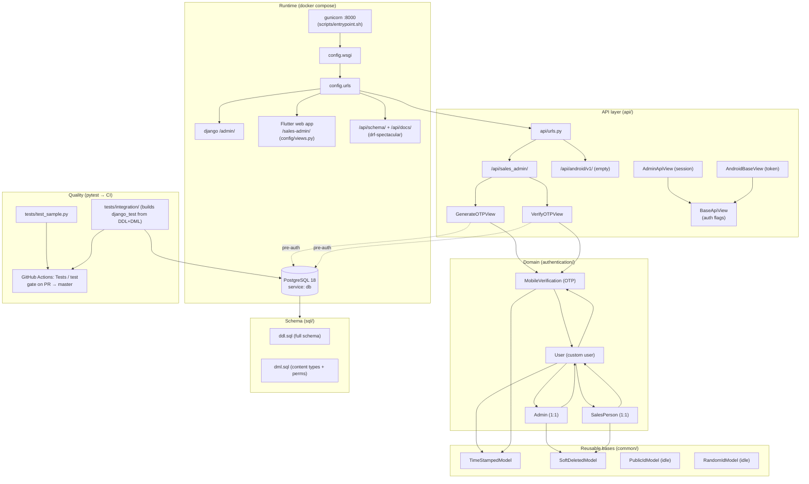

# SaiSeeds Backend ERP — Knowledge Graph

> Machine/navigation map of the codebase: every component (node), what it does,
> and how it connects to everything else. Start here before touching a system,
> then dive into [`skills/`](../skills.md) for workflow-level detail.
>
> See also: [skills.md](../skills.md) (index of domain docs), `docs/api/openapi.yml`
> (auto-generated API reference).

## 1. Architecture at a glance



## 2. Node registry

### Entry points & infrastructure

| Node | Path | Purpose | Edges |
|---|---|---|---|
| `web` service | `docker-compose.yml`, `Dockerfile` | Python 3.14-slim image; `python:3.14-slim`; bind-mounts repo at `/app`; port 8000 | starts → `scripts/entrypoint.sh`; depends_on → `db` (healthy) |
| `db` service | `docker-compose.yml` | PostgreSQL 18, port 5432, named volume `postgres_data`; `pg_isready` healthcheck; `shared_buffers=128MB` | provider ← web, tests, DBeaver |
| Container entrypoint | `scripts/entrypoint.sh` | Starts collectstatic → `createsuperuser_if_not_exists` → gunicorn. **Migrations are commented out** (schema is pre-applied). Invoked via `bash` (Dockerfile `ENTRYPOINT ["bash", ...]`) so it needs no `+x` | runs → gunicorn `config.wsgi` |
| WSGI / ASGI | `config/wsgi.py`, `config/asgi.py` | Gunicorn hooks in here | → `config.urls` |
| Root URLconf | `config/urls.py` | Mounts `/admin/`, `/api/`, `/api/schema|docs/`, `/sales-admin/...` catch-all | → `api/urls.py`, `config.views.flutter_catch_all`, drf-spectacular views |
| Flutter catch-all | `config/views.py` | Serves `web/build/web/` (committed build output) for all `/sales-admin/*` routes; SPA fallback to `index.html` | serves ← `web/` |

### Configuration

| Node | Path | Purpose | Edges |
|---|---|---|---|
| `config/settings.py` | single settings module | env-driven; DRF default auth = Session+Token, default permission = `IsAuthenticated`; CORS allows credentials; timezone `Asia/Kolkata`; `AUTH_USER_MODEL = authentication.User`; `MIGRATION_MODULES` disables built-in-app migrations | configures → all apps; reads → env vars |
| Superuser bootstrap | `config/management/commands/createsuperuser_if_not_exists.py` | Idempotent superuser create; dev fallback `9999999999/admin` when `DEBUG=True` | called by → entrypoint |

### API layer

| Node | Path | Purpose | Edges |
|---|---|---|---|
| `BaseApiView` | `api/views.py` | Flag-driven base (`auth_required`, `admin_required`, `superuser_required`) → DRF `authentication_classes`/`get_permissions()` | base ← `AdminApiView`, `AndroidBaseView`; also defines `fire_and_forget` (post-commit background thread) |
| `AdminApiView` | `api/admin.py` | Sales-admin website base: **session cookie** auth + requires `Admin` profile | → `BaseApiView`, `.permissions.IsAdminUser` |
| `AndroidBaseView` | `api/android/base.py` | Salesperson Android base: **bearer TokenAuthentication** + requires `SalesPerson` profile | → `BaseApiView`, `.permissions.IsSalesPerson` |
| Permissions | `api/permissions.py` | `IsRolePermission` meta-class + `IsAdminUser`, `IsSuperUser`, `IsSalesPerson` | keyed off → `User.is_admin_user/is_superuser/is_salesperson` |
| Top API router | `api/urls.py` | `/api/android/`, `/api/sales_admin/` | → namespace URLconfs |
| `GenerateOTPView` | `api/sales_admin/GenerateOTPView.py` | `POST /api/sales_admin/auth/otp/request` — pre-auth, `AllowAny`; creates a `MobileVerification` challenge; deliberately vague response | creates → `MobileVerification`; looks up → `User` |
| `VerifyOTPView` | `api/sales_admin/VerifyOTPView.py` | `POST /api/sales_admin/auth/otp/verify` — pre-auth, `AllowAny`; validates OTP, marks used, returns DRF `Token` + user payload | reads → `MobileVerification`, `User`, `rest_framework.authtoken`; calls → `MobileVerification.mark_used()` |
| Android v1 | `api/android/v1/urls.py` | Versioned namespace, currently empty (endpoints built out one module each) | — |

> Naming gotcha: `api/admin.py` defines the **`AdminApiView` base controller**, not
> the Django admin site (which lives in `authentication/admin.py`).

### Domain — authentication

| Node | Path | Purpose | Edges |
|---|---|---|---|
| `User` | `authentication/models/User.py` | Custom user (`AbstractBaseUser` + `PermissionsMixin`); `phone_number` is `USERNAME_FIELD` (10 digits, no country code); password only for superusers; `created_by`/`verified_by` self-FK invariants (superuser must have both NULL); role helpers `role`, `is_salesperson`, `is_admin_user` | extends → `TimeStampedModel`; related ← `Admin`, `SalesPerson`, `MobileVerification` |
| `Admin` | `authentication/models/Admin.py` | Application admin profile (1:1). Only a superuser may create one | extends → `TimeStampedModel`, `SoftDeletedModel`; 1:1 → `User` |
| `SalesPerson` | `authentication/models/SalesPerson.py` | Salesperson profile (1:1). Only an Admin (or superuser) may create one | extends → `TimeStampedModel`, `SoftDeletedModel`; 1:1 → `User` |
| `MobileVerification` | `authentication/models/MobileVerification.py` | OTP challenge: 6-digit secret, 5-min expiry, `is_used` flag; `generate_otp()` uses `secrets` | FK → `User`; extends → `TimeStampedModel`; read/written by → OTP views |
| Admin site | `authentication/admin.py` | Registers `User`, `Admin`, `SalesPerson`, `MobileVerification`; unregisters stock `Group` admin | configures → Django `admin` |
| Validator | `authentication/validators.py` | `^\d{10}$` 10-digit phone validator | used by → `User.phone_number` |

### Reusable bases — common

| Node | Path | Purpose | Used by |
|---|---|---|---|
| `TimeStampedModel` | `common/models/timestamped.py` | `created_at` (`indian_now`) / `updated_at`; `indian_now()` = Asia/Kolkata localtime | `User`, `Admin`, `SalesPerson`, `MobileVerification` |
| `SoftDeletedModel` | `common/models/soft_deleted.py` | Soft delete: `is_deleted`/`deleted_at`/`deleted_by`; managers `objects` (hide deleted) + `all_objects`; `delete()` requires `deleted_by` with the `delete_<model>` permission; `hard_delete()`, `restore()` | `Admin`, `SalesPerson` |
| `PublicIdModel` | `common/models/public_id.py` | 12-char `public_id` for user-facing refs (intended for orders/invoices) | (no concrete use yet) |
| `RandomIdModel` | `common/models/random_id.py` | random `UUIDField` column | (no concrete use yet) |

### Schema & data

| Node | Path | Purpose | Edges |
|---|---|---|---|
| `sql/ddl.sql` | full schema | All tables: Django built-ins (`django_migrations`, `django_content_type`, `auth_*`, `django_session`, `django_admin_log`) + `authentication_*` + `authtoken_token`. **Dev-only reference**; prod schema applied manually on Neon | consumed by → `reload_db.sh`, `integration_db.sh`, integration tests |
| `sql/dml.sql` | seed data | Content types + permissions (idempotent `ON CONFLICT DO NOTHING`, `setval()` sequence resets, wrapped in txn). Superuser NOT seeded here | consumed by → same as above |
| `MIGRATION_MODULES` | `config/settings.py` | Project apps (`authentication`, `common`, `config`) keep real migrations; built-in apps are SQL-managed | drives → `migrate` behavior |

### Tooling & quality

| Node | Path | Purpose | Edges |
|---|---|---|---|
| `scripts/run.sh` | single entry point | `build/up/down/restart/reload-db/logs/status/shell/psql/flutter/schema/test/test-unit/test-integration/lint/typecheck`. Tests/lint/typecheck run in **short-lived one-off `web` containers** (`compose run --rm --no-deps --entrypoint ""`) to avoid booting gunicorn | calls → `reload_db.sh`, `integration_db.sh`, compose |
| `scripts/reload_db.sh` | local DB reload | `--step all/ddl/dml`; **local Docker Postgres only, never prod** | reads → `sql/ddl.sql`, `sql/dml.sql`, `.env.dev` |
| `scripts/integration_db.sh` | test DB builder | Build/drop throwaway `django_test` DB from DDL+DML | consumed by integration tests (now via `tests/integration/base.py`) |
| Unit tests | `tests/test_sample.py` | Sanity pytest | none |
| Integration framework | `tests/integration/` | `base.py` (`IntegrationDbContext`, `LiveServer`, `IntegrationTestCase`) + `conftest.py` fixtures; builds `django_test` from `sql/ddl.sql`+`dml.sql`, `migrate --fake`, runs real `runserver` on `127.0.0.1:8001`, exercises HTTP via `requests.Session` | depends on → `db`; consumed by → `test_auth_flow.py` |
| CI | `.github/workflows/tests.yml` | Builds images, starts `db`, runs `test-unit` + `test-integration` + `lint` in one-off containers | gate on → PRs to `master`; renders check `Tests / test` |
| Branch protection | GitHub settings | `master` requires `Tests / test` to pass + PR review | enforced by → GitHub |
| Skills | `skills/*.md`, `.agents/skills/run-tests/SKILL.md` | Domain knowledge + test-run instructions (node-id docstring convention) | read before editing |

## 3. Data model

```mermaid
erDiagram
    USER ||--o| ADMIN : "admin_profile (1:1)"
    USER ||--o| SALESPERSON : "salesperson_profile (1:1)"
    USER ||--o{ MOBILEVERIFICATION : "mobile_verifications"
    USER o|--o{ USER : "created_by / verified_by (self-FK)"

    USER {
        char phone_number "10 digits, unique, USERNAME_FIELD"
        char name
        email email
        bool is_verified
        bool is_staff is_superuser is_active
        fk created_by nullable "NULL for superusers"
        fk verified_by nullable "required when is_verified"
        dt date_joined
    }
    ADMIN {
        fk user "1:1, CASCADE"
        bool is_deleted "soft delete"
        dt deleted_at
        fk deleted_by
    }
    SALESPERSON {
        fk user "1:1, CASCADE"
        bool is_deleted "soft delete"
        dt deleted_at
        fk deleted_by
    }
    MOBILEVERIFICATION {
        fk user "CASCADE"
        char phone_number "10 digits"
        char otp "6 digits"
        bool is_used
        dt expires_at "created_at + 5min"
    }
```

## 4. URL / routing map

```
/                    -> 404
/admin/              -> Django admin (authentication/admin.py)
/api/
├── sales_admin/
│   ├── auth/otp/request   POST  GenerateOTPView         (AllowAny)
│   └── auth/otp/verify    POST  VerifyOTPView          (AllowAny → Token)
└── android/
    └── v1/                (empty — being built)
/api/schema/         -> OpenAPI JSON   (drf-spectacular)
/api/docs/           -> Swagger UI
/sales-admin[/...]   -> Flutter build  (config/views.py catch-all)
```

> Auth model: default DRF global = `Session + Token` auth, `IsAuthenticated`.
> Pre-auth endpoints (OTP) opt out with `authentication_classes = []` and
> `permission_classes = [AllowAny]`. Client base views pick credentials:
> admin → session cookie; android → bearer token.

## 5. Data & schema flow

```
models/*.py  --makemigrations-->  migrations/  --migrate(local only)-->  Docker DB
                    \                                                    |
                     \--(copy DDL from DBeaver)-->  Neon SQL Editor  <---/
                                              (prod schema = manual SQL, never migrate)

sql/ddl.sql + sql/dml.sql ----reload_db.sh / integration tests---->  local Docker "django[_test]" DB
```

## 6. Test & release flow

```
feature branch → PR to master
  → GitHub Actions "Tests / test" (test-unit + test-integration + lint)
      ↑ branch protection blocks merge until it passes
master merged → Render auto-deploy (Docker build))
  → entrypoint: collectstatic → createsuperuser_if_not_exists → gunicorn
  → keep-alive cron pings every 10 min
```

## 7. Gotchas / invariants

- Project apps run **real migrations**; built-in `django.*` apps are **SQL-managed** in `sql/ddl.sql`.
- Prod (Neon) schema is applied **manually** — never rely on `migrate` in prod; never run `reload_db.sh` against prod.
- `web/build/web/` (Flutter) is **committed**; rebuild with `bash scripts/run.sh flutter` before pushing Flutter changes.
- Tests never boot gunicorn: they run in one-off containers and integration tests start their own `runserver` on `127.0.0.1:8001`.
- Every test docstring must state its runnable pytest node id (see `.agents/skills/run-tests/SKILL.md`).
- `api/admin.py` = `AdminApiView` base, not Django admin.

_Keep this graph in sync when adding apps, endpoints, models, or schema flows._