# SaiSeeds Backend ERP — Knowledge Graph

> Machine/navigation map of the codebase: every component (node), what it does,
> and how it connects to everything else. Start here before touching a system,
> then dive into [`skills/`](../skills.md) for workflow-level detail.
>
> See also: [skills.md](../skills.md) (index of domain docs), `docs/api/openapi.yml`
> (auto-generated API reference).

## 1. Architecture at a glance

```mermaid
graph TD
    subgraph RUNS["Runtime (docker compose)"]
        GW["entrypoint.sh<br/>(runserver in dev, gunicorn in prod)"] --> WSGI["config.wsgi"]
        WSGI --> URLS["config.urls"]
        DB[(PostgreSQL 18<br/>service: db)]
        URLS --> ADMIN["django /admin/"]
        URLS --> FL["Flutter web app<br/>/sales-admin/ (config/views.py)"]
        URLS --> SCHEMA["/api/schema/ + /api/docs/<br/>(drf-spectacular, superuser)"]
    end

    subgraph AUTHCLASSES["Auth classes (api/authentication.py)"]
        SESSAUTH["SessionAuthentication<br/>(web only — cookie, 401 semantics)"]
        EXPTAUTH["ExpiringTokenAuthentication<br/>(Android only — bearer token, 24h TTL)"]
    end

    subgraph API["Web API layer (api/) — session-only, never touches tokens"]
        URLS --> APIROOT["api/urls.py"]
        APIROOT --> SA["/api/sales_admin/"]
        SA --> OTPVER["VerifyOTPView (TOTP login, session-only)"]
        APIROOT --> TSENTRY["TestSentryView<br/>(/api/test-sentry/, superuser)"]
        ADMINV["AdminApiView (session)"] --> BASE["BaseApiView<br/>(auth flags)"]
        SESSAUTH --> ADMINV
        OTPVER -. pre-auth .-> DB
    end

    subgraph ANDROIDAPP["Android app (android/) — token-only, never touches sessions"]
        URLS --> ANDROOT["android/urls.py"]
        ANDROOT --> AND["/android/api/v1/<br/>(routes.ROUTES, version-inherited)"]
        AND --> ANDLOGIN["LoginView (TOTP login, token-only)"]
        ANDV["AndroidBaseView (token)"] --> BASE
        EXPTAUTH --> ANDV
        ANDLOGIN -. pre-auth .-> DB
    end

    subgraph DOMAIN["Domain (authentication/)"]
        U["User (custom user)"]
        U --> ADMINP["Admin (1:1)"]
        U --> SPP["SalesPerson (1:1)"]
    end

    subgraph AGG["Domain (aggregator/)"]
        CTRY["Country"]
        ST["State"]
        CIT["City"]
        PIN["Pincode"]
        ADDR["Address"]
        CTRY --> ST
        ST --> CIT
        CIT --> PIN
        CIT --> ADDR
        ST --> ADDR
        CTRY --> ADDR
        PIN --> ADDR
        SPP --> CIT
    end

    subgraph SALES["Sales domain (aggregator/)"]
        STATUS["Status + StatusIds<br/>(generic enum: order + client)"]
        CROP["Crop"]
        CL["Client<br/>(created_by=salesperson,<br/>verified_by=sales admin)"]
        TA["TransportAgency"]
        CON["Contact"]
        CA["ClientAddress (link)"]
        CC["ClientContact (link)"]
        CTA["ClientTransportAgency (link)"]
        PROD["Product<br/>(public_id P-…)"]
        PP["ProductPackaging<br/>(public_id PP-…)"]
        DD["DispatchDetails<br/>(dispatched_by=sales admin)"]
        PDD["PrivateDispatchDetails<br/>(dispatched_by=sales admin)"]
        ORD["Order<br/>(public_id ORD-…)"]
        OI["OrderItem"]

        CL --> CA --> ADDR
        CL --> CC --> CON
        CL --> CTA --> TA
        CL --> STATUS
        CROP --> PROD --> PP
        ORD --> CL
        ORD --> ADDR
        ORD --> STATUS
        ORD --> DD
        ORD --> PDD
        ORD --> OI --> PP
        DD --> CIT
        PDD --> CIT
        SPP --> CL
        SPP --> ORD
        ADMINP --> CL
        ADMINP --> DD
        ADMINP --> PDD
    end

    subgraph COMMON["Reusable bases (common/)"]
        TS["TimeStampedModel"]
        SD["SoftDeletedModel"]
        CB["CreatedByModel"]
        PID["PublicIdModel (idle)"]
        RID["RandomIdModel (idle)"]
    end

    subgraph DATA["Schema (sql/)"]
        DDL["ddl.sql (full schema, all apps)"]
        DML["dml.sql (content types + perms + seed users)"]
        APF["admin_perf.sql (pg_trgm admin indexes)"]
        S24["session_auth_24h.sql (prod FK + TTL indexes)"]
    end

    DB --> DATA
    ADMINP --> U
    SPP --> U
    ADMINP --> SD
    ADMINP --> CB
    SPP --> SD
    SPP --> CB
    ADDR --> CB
    CTRY --> CB
    ST --> CB
    CIT --> CB
    PIN --> CB
    U --> TS
    ADMINP --> TS
    SPP --> TS

    subgraph QA["Quality (pytest → CI)"]
        UNIT["tests/ (DML-seeded pytest suite)"]
        CI["GitHub Actions: Tests / test<br/>gate on PR → master"]
    end
    UNIT --> CI
```



## 2. Node registry

### Entry points & infrastructure

| Node | Path | Purpose | Edges |
|---|---|---|---|
| `web` service | `docker-compose.yml`, `Dockerfile` | Python 3.14-slim image; bind-mounts repo at `/app`; port 8000 | starts → `scripts/entrypoint.sh`; depends_on → `db` (healthy) |
| `db` service | `docker-compose.yml` | PostgreSQL 18, port 5432, named volume `postgres_data`; `pg_isready` healthcheck; `shared_buffers=128MB`; timezone UTC | provider ← web, tests, DBeaver |
| Container entrypoint | `scripts/entrypoint.sh` | Starts collectstatic → `createsuperuser_if_not_exists` → then runs **dev `runserver`** when `DEBUG=true` (live reload on bind mount) or **gunicorn** otherwise (`--workers`/`--threads` env). **`migrate` is commented out** — the whole schema is pre-applied SQL (see `sql/` below). Invoked via `bash` (Dockerfile `ENTRYPOINT ["bash", ...]`) so it needs no `+x` | runs → `config.wsgi` / `manage.py runserver` |
| WSGI / ASGI | `config/wsgi.py`, `config/asgi.py` | Gunicorn hooks in here | → `config.urls` |
| Root URLconf | `config/urls.py` | Mounts `/admin/`, `/api/` (web, session-only), `/android/` (Android app, token-only), `/api/schema|docs/` (superuser-only), `/sales-admin/...` catch-all | → `api/urls.py`, `android/urls.py`, `config.views.flutter_catch_all`, drf-spectacular views |
| Flutter catch-all | `config/views.py` | Serves `web/build/web/` (committed build output) for all `/sales-admin/*` routes; SPA fallback to `index.html` | serves ← `web/` |

### Configuration

| Node | Path | Purpose | Edges |
|---|---|---|---|
| `config/settings.py` | single settings module | env-driven (`SECRET_KEY`, `DEBUG`, `ALLOWED_HOSTS` have fallbacks); DRF default auth (`SessionAuthentication` + `ExpiringTokenAuthentication`) is only the fallback for views that don't pick one explicitly (e.g. the schema/docs views) — every real endpoint sets its own via `AdminApiView` (session-only) or `AndroidBaseView` (token-only); permission `IsAuthenticated`; Argon2-first password hashers; `CONN_MAX_AGE=60` + `CONN_HEALTH_CHECKS` + db `timezone=Asia/Kolkata`; WhiteNoise static with `STATIC_ROOT=staticfiles`; `SESSION_COOKIE_AGE=86400` + `TOKEN_TTL_HOURS=24`; `CORS_ALLOW_CREDENTIALS`; Sentry init when `SENTRY_DSN` set and not DEBUG | configures → all apps; reads → env vars |
| Superuser bootstrap | `config/management/commands/createsuperuser_if_not_exists.py` | Idempotent superuser create; dev fallback `9999999999/admin` when `DEBUG=True`; `DJANGO_SUPERUSER_*` env otherwise | called by → entrypoint |

### API layer

Strict client separation: the web (`api/`) app is **session-only** and never
touches `authtoken_token`; the Android app (`android/`, a separate Django app)
is **token-only** and never touches sessions. `BaseApiView` is the shared
role-flag parent both client bases build on.

| Node | Path | Purpose | Edges |
|---|---|---|---|
| `BaseApiView` | `api/views.py` | Flag-driven base (`auth_required`, `admin_required`, `superuser_required`) → DRF `get_permissions()`; does not itself pick an auth scheme; also defines `fire_and_forget` (post-commit background thread) | base ← `AdminApiView`, `AndroidBaseView` |
| Auth classes | `api/authentication.py` | `SessionAuthentication` (DRF session but with a real `WWW-Authenticate` challenge so anonymous = **401**, not 403; used only by the web) + `ExpiringTokenAuthentication` (24h TTL via `TOKEN_TTL_HOURS`; an expired token is deleted on first use; used only by Android) | used by → `AdminApiView`, `AndroidBaseView` |
| `AdminApiView` | `api/admin.py` | Sales-admin website base: **session cookie only** | → `BaseApiView` |
| Permissions | `api/permissions.py` | `IsRolePermission` meta-class + `IsAdminUser`, `IsSuperUser`, `IsSalesPerson` | keyed off → `User.is_admin_user/is_superuser/is_salesperson` |
| Top API router | `api/urls.py` | `/api/sales_admin/`, `/api/utilities/` (web, session-only) | → namespace URLconfs |
| `VerifyOTPView` | `api/sales_admin/VerifyOTPView.py` | `POST /api/sales_admin/auth/otp/verify` — pre-auth, `AllowAny`; verifies the user's **TOTP** code, opens a session, returns the user payload + `can_create_admin`/`can_create_sales_person` flags (no token) | reads → `User`; calls → `login()` + `get_token()` (issues `sessionid` + `csrftoken` cookies) |
| `TestSentryView` | `api/test_sentry.py` | `GET/POST /api/test-sentry/` — raises on purpose to verify error tracking (GlitchTip/Sentry); superuser-only so it can't be abused | gated by → `IsSuperUser` permission |

### Android app (separate Django app: `android/`)

Mounted at `/android/api/<version>/...` (`config/urls.py`). Version
inheritance: a view introduced at `vX` is served under every later `vY`
(`Y >= X`) unless that version overrides the same route — enforced by
`android/api/routing.py`, not left as a convention.

| Node | Path | Purpose | Edges |
|---|---|---|---|
| `AndroidBaseView` | `android/api/base.py` | Salesperson Android base: **bearer `ExpiringTokenAuthentication` only** + requires `SalesPerson` profile | → `BaseApiView`, `api.permissions.IsSalesPerson` |
| Routing mechanism | `android/api/routing.py` | `merged_routes(versions)` merges each version's `routes.ROUTES` in order (later wins); `build_urlpatterns` turns the merge into urlpatterns | used by → `android/api/urls.py` |
| Version router | `android/api/urls.py` | `VERSIONS = ["v1", ...]`; mounts `<version>/` with routes inherited from every earlier version | → `routing.build_urlpatterns` |
| Android v1 | `android/api/v1/routes.py` | `ROUTES`: `auth/login` (`LoginView`), `auth/logout` (`LogoutView`), `auth/reauthenticate` (`ReauthenticateView`), `utilities/cities` (`CitiesView`) | → `AndroidBaseView` (except `LoginView`, pre-auth) |
| `LoginView` | `android/api/v1/LoginView.py` | `POST /android/api/v1/auth/login` — pre-auth, `AllowAny`; TOTP login for sales persons, mints/rotates a bearer `Token` (mirrors `VerifyOTPView` but token-only, no session) | reads → `User`; writes → `rest_framework.authtoken.Token` |

> Naming gotcha: `api/admin.py` defines the **`AdminApiView` base controller**, not
> the Django admin site (which lives in `authentication/admin.py`).

### Domain — authentication

| Node | Path | Purpose | Edges |
|---|---|---|---|
| `User` | `authentication/models/User.py` | Custom user (`AbstractBaseUser` + `PermissionsMixin`); `phone_number` is `USERNAME_FIELD` (10 digits, no country code); password only for staff; everyone else logs in via **TOTP authenticator app**; `created_by`/`verified_by` self-FK invariants (superusers self-reference); TOTP helpers (`generate_totp_secret`, `enable_totp`, `verify_totp`, provisioning URI); role helpers `role`, `is_salesperson`, `is_admin_user`, `is_verified_user`, `can_login_with_password` | extends → `TimeStampedModel`; related ← `Admin`, `SalesPerson` |
| `Admin` | `authentication/models/Admin.py` | Application admin profile (1:1). Only a superuser may create one; `can_update_stock_count` flag | extends → `TimeStampedModel`, `SoftDeletedModel`, `CreatedByModel`; 1:1 → `User` |
| `SalesPerson` | `authentication/models/SalesPerson.py` | Salesperson profile (1:1). Only an Admin (or superuser) may create one; `city` FK | extends → `TimeStampedModel`, `SoftDeletedModel`, `CreatedByModel`; 1:1 → `User`; FK → `aggregator.City` |
| Admin site | `authentication/admin.py` | Registers `User`, `Admin`, `SalesPerson`; enforces who may grant `Admin`/`SalesPerson` roles; unregisters stock `Group` admin | configures → Django `admin` |
| Validator | `authentication/validators.py` | `^\d{10}$` 10-digit phone validator | used by → `User.phone_number` |

### Domain — aggregator (geo master data)

| Node | Path | Purpose | Edges |
|---|---|---|---|
| `Country` | `aggregator/models/Country.py` | `name` + `iso_code` (both unique, indexed); root of the geo hierarchy | extends → `TimeStampedModel`, `SoftDeletedModel`, `CreatedByModel`; 1:N → `State` |
| `State` | `aggregator/models/State.py` | `name` + optional `code`; unique `(country, name)` | 1:N → `City` |
| `City` | `aggregator/models/City.py` | `name`; unique `(state, name)`; `country` property; `ordering = name` | 1:N → `Pincode`, `Address`; ← `SalesPerson.city` |
| `Pincode` | `aggregator/models/Pincode.py` | `code`; unique `(city, code)`; `state`/`country` convenience properties | 1:N → `Address` |
| `Address` | `aggregator/models/Address.py` | Denormalised pincode/city/state/country chain so any level can be listed/filtered; `clean()` validates the chain matches | FK → all four geo nodes |
| aggregator admin | `aggregator/admin.py` | `SoftDeleteModelAdmin` + `autocomplete_fields`/`list_select_related` so related picks don't N+1 | configures → Django `admin` |

### Domain — aggregator (sales)

| Node | Path | Purpose | Edges |
|---|---|---|---|
| `Status` | `aggregator/models/Status.py` | Generic enum-like status rows (ids 1–9, seeded in `sql/dml.sql`); hosts `StatusIds` and the `Status.by_id()` resolver. **No migrations — the enum values mirror `dml.sql` rows and must be kept in sync.** | referenced by → `Order.status`, `Client.status`, `OrderOperations`, `ClientOperations` |
| `StatusIds` | `aggregator/models/Status.py` | `enum.IntEnum` — the single source of truth for the status CODE→id mapping: member **name** == seeded `code`, member **value** == row `id` (`StatusIds.BOOKED.name == "BOOKED"`, `int(StatusIds.BOOKED) == 1`). `order_statuses()` = ids 1–7, `client_statuses()` = ids 8–9. | derives → `Order.ORDER_STATUS_CODES`, `Client.CLIENT_STATUS_CODES`; used by → `OrderOperations`, `ClientOperations`, tests |
| `Order` | `aggregator/models/Order.py` | Booked order exposed by `public_id` (`ORD-…`); lifecycle statuses limited to `StatusIds.order_statuses()` | FK → `Client`, `Address`, `Status`; 1:N → `OrderItem` |
| `Client` | `aggregator/models/Client.py` | Customer company; verification statuses limited to `StatusIds.client_statuses()` | FK → `Status`, `User` (`verified_by`); 1:N → `ClientAddress`, `ClientContact`, `ClientTransportAgency` |

### Reusable bases — common

| Node | Path | Purpose | Used by |
|---|---|---|---|
| `TimeStampedModel` | `common/models/timestamped.py` | `created_at` (`indian_now`) / `updated_at`; `indian_now()` = Asia/Kolkata localtime | `User`, `Admin`, `SalesPerson`, aggregator models |
| `CreatedByModel` | `common/models/created_by.py` | `created_by` user audit FK (`PROTECT`, auto-filled with `request.user` by `AuditFieldsAdminMixin` if you use ModelAdmin) | `Admin`, `SalesPerson`, all aggregator models |
| `SoftDeletedModel` | `common/models/soft_deleted.py` | Soft delete: `is_deleted`/`deleted_at`/`deleted_by`; managers `objects` (hide deleted) + `all_objects`; `delete()` requires `deleted_by` with the `delete_<model>` permission; `hard_delete()`, `restore()` | `Admin`, `SalesPerson`, aggregator models |
| Admin helpers | `common/admin.py`, `common/models/` | `AuditFieldsAdminMixin` (read-only audit fieldsets, auto `created_by`) + `SoftDeleteModelAdmin` (soft delete through the admin) | aggregator + auth admins |
| `PublicIdModel` | `common/models/public_id.py` | 12-char `public_id` for user-facing refs (intended for orders/invoices) | (no concrete use yet) |
| `RandomIdModel` | `common/models/random_id.py` | random `UUIDField` column | (no concrete use yet) |

### Schema & data

| Node | Path | Purpose | Edges |
|---|---|---|---|
| `sql/ddl.sql` | full schema | **Every** table — Django built-ins (`django_migrations`, `django_content_type`, `auth_*`, `django_session`, `django_admin_log`), custom apps (`authentication_*`, `aggregator_*`), and `authtoken_token`. Dev/test reference; prod schema applied manually on Neon | consumed by → `reload_db.sh` |
| `sql/dml.sql` | seed data | Content types (14) + permissions (56, 4 per model) + **reconciliation superuser** `9999999999` (with TOTP secret `JBSWY3DPEHPK3PXP`) + a no-TOTP user `8888888888` for the negative-path test. Idempotent `ON CONFLICT DO NOTHING`, `setval()` sequence resets, wrapped in txn | consumed by → same as above |
| `sql/admin_perf.sql` | prod DDL | `pg_trgm` extension + GIN trigram indexes on `authentication_user(name, email)` for Django admin `ILIKE` search | applied to → local/test DBs, Neon (manual) |
| `sql/session_auth_24h.sql` | prod DDL | `authtoken_token.user_id` FK (DRF only adds it via migrate) + `created` index for the TTL expiry sweep | applied to → Neon (manual) |
| `MIGRATION_MODULES` | `config/settings.py` | Disables migrations for built-in `django.*` apps via a dict comprehension (settings comment additionally states the project apps are schema-managed). **No migration files exist** — the repo has one empty `authentication/migrations/` dir. The *entire* schema is SQL-managed; with no migrations, Django's test runner syncs test tables straight from the models and `tests/common.py` seeds the `dml.sql` data | drives → `migrate` behaviour |

### Tooling & quality

| Node | Path | Purpose | Edges |
|---|---|---|---|
| `scripts/run.sh` | single entry point | `build/up/down/restart/reload-db/logs/status/shell/psql/flutter/schema/test/test-unit/test-dml/lint/typecheck`. Tests/lint/typecheck run in **short-lived one-off `web` containers** (`compose run --rm --no-deps --entrypoint ""`) to avoid booting gunicorn | calls → `reload_db.sh`, compose |
| `scripts/reload_db.sh` | local DB reload | `--step all/ddl/dml`; **local Docker Postgres only, never prod** | reads → `sql/ddl.sql`, `sql/dml.sql`, `.env.dev` |
| Test suite | `tests/` | DML-seeded pytest suite (models, order/client operations, TOTP/auth flow, token TTL); every class/method carries its pytest node-id docstring | uses → `tests/common.py` (`DMLTestCase` re-seeds `sql/dml.sql`); run via → `test-unit` / `test-dml` |
| CI | `.github/workflows/tests.yml` | Builds images, starts `db`, runs `test-unit` + `test-dml` + `lint` in one-off containers | gate on → PRs to `master`; renders check `Tests / test` |
| Branch protection | GitHub settings | `master` requires `Tests / test` to pass + PR review | enforced by → GitHub |
| Skills | `skills/*.md`, `.agents/skills/run-tests/SKILL.md` | Domain knowledge + test-run instructions (node-id docstring convention) | read before editing |

## 3. Data model

```mermaid
erDiagram
    USER ||--o| ADMIN : "admin_profile (1:1)"
    USER ||--o| SALESPERSON : "salesperson_profile (1:1)"
    USER o|--o| USER : "created_by / verified_by (self-FK)"
    SALESPERSON o|--o| CITY : "city FK"
    COUNTRY ||--o{ STATE : "states"
    STATE ||--o{ CITY : "cities"
    CITY ||--o{ PINCODE : "pincodes"
    CITY ||--o{ ADDRESS : "city"
    STATE ||--o{ ADDRESS : "state"
    COUNTRY ||--o{ ADDRESS : "country"
    PINCODE ||--o{ ADDRESS : "pincode"

    USER {
        char phone_number "10 digits, unique, USERNAME_FIELD"
        char name
        email email
        bool is_verified is_staff is_superuser is_active
        bool totp_enabled
        char totp_secret "base32, nullable"
        fk created_by "self; superusers self-reference"
        fk verified_by "required when is_verified"
        dt date_joined
    }
    ADMIN {
        fk user "1:1, CASCADE"
        bool can_update_stock_count
        fk created_by "PROTECT; acting request.user"
        bool is_deleted "soft delete"
    }
    SALESPERSON {
        fk user "1:1, CASCADE"
        fk city "→ aggregator_city"
        fk created_by "PROTECT; acting request.user"
        bool is_deleted "soft delete"
    }
    COUNTRY {
        char name "unique"
        char iso_code "unique, ISO 3166"
    }
    STATE {
        char name "(country, name) unique"
        char code "nullable, e.g. MH"
        fk country "PROTECT"
    }
    CITY {
        char name "(state, name) unique"
        fk state "PROTECT"
    }
    PINCODE {
        char code "(city, code) unique"
        fk city "PROTECT"
    }
    ADDRESS {
        char address_line_1
        char address_line_2 "optional"
        fk pincode "PROTECT"
        fk city "PROTECT"
        fk state "PROTECT"
        fk country "PROTECT"
    }
```

> Statuses are not drawn above: `aggregator_status` is a generic seed table
> referenced via `Order.status` / `Client.status`. The seeded CODE→id mapping
> lives in Python in `StatusIds` (`aggregator/models/Status.py`) and must be
> kept in sync with the `sql/dml.sql` rows.

## 4. URL / routing map

```
/                    -> 404
/admin/              -> Django admin (authentication/admin.py + aggregator/admin.py)
/api/                                          (web, SESSION-ONLY, never touches tokens)
├── sales_admin/
│   ├── auth/otp/verify      POST  VerifyOTPView          (AllowAny → TOTP login, opens a session)
│   ├── auth/logout          POST  LogoutView             (IsAuthenticated → flushes session)
│   ├── admins               GET/POST  AdminsView         (IsSuperUser)
│   ├── admins/<int:id>      PATCH/DELETE  UpdateAdminView (IsSuperUser)
│   ├── sales-people         GET/POST  SalesPeopleView    (IsAdminUser)
│   └── sales-people/<int:id> PATCH/DELETE  UpdateSalesPersonView (IsAdminUser)
├── utilities/
│   ├── reauthenticate       GET   ReauthenticateView      (IsAuthenticated)
│   └── cities               GET   CitiesView              (IsSuperUser)
└── test-sentry/          GET/POST  TestSentryView (superuser → forced 500)
/api/schema/         -> OpenAPI JSON   (drf-spectacular, superuser only)
/api/docs/           -> Swagger UI
/android/                                      (Android app, TOKEN-ONLY, never touches sessions)
└── api/
    └── v1/                    (routes.ROUTES; inherited by every later version)
        ├── auth/login         POST  LoginView            (AllowAny → TOTP login, mints a token)
        ├── auth/logout        POST  LogoutView           (IsSalesPerson → deletes the token)
        ├── auth/reauthenticate GET  ReauthenticateView    (IsSalesPerson)
        └── utilities/cities   GET   CitiesView            (IsSalesPerson)
/sales-admin[/...]   -> Flutter build  (config/views.py catch-all)
```

> Route convention: single-object URLs use `<int:id>` (never `<int:pk>`); the
> view receives it as the `id` kwarg and looks the row up with `id=…`.

> Auth model: **strict client separation**. `api/` (web) uses
> `AdminApiView` → `SessionAuthentication` only; `android/` uses
> `AndroidBaseView` → `ExpiringTokenAuthentication` only (24h TTL). The DRF
> global default (`SessionAuthentication` + `ExpiringTokenAuthentication`,
> `IsAuthenticated`) is only a fallback for views that pick neither base
> explicitly (schema/docs). Pre-auth endpoints (`VerifyOTPView`,
> `android.api.v1.LoginView`) opt out with `authentication_classes = []` and
> `permission_classes = [AllowAny]`.
>
> **CSRF on API routes:** DRF `APIView` handlers are wrapped in `csrf_exempt`,
> so the global `CsrfViewMiddleware` never gates DRF endpoints. CSRF is
> enforced only by DRF `SessionAuthentication` on session-authenticated
> state-changing requests — i.e. only on the web side. `VerifyOTPView` calls
> `get_token(request)` so the login response ships a `csrftoken` cookie; the
> Flutter SPA must read that cookie and echo it via the `X-CSRFToken` header
> on later POSTs (see `skills/api.md` for the exact flow). The Android side
> has no session and therefore no CSRF concern.

## 5. Data & schema flow

```
models/*.py ----(DBeaver: copy table DDL)---->  Neon SQL Editor (prod, manual)
                    |
                    v
            sql/ddl.sql (full schema reference)

sql/ddl.sql + sql/dml.sql + sql/admin_perf.sql
    ----reload_db.sh---->
            local Docker "django" DB

No migration files exist in the repo. `migrate` is commented out of the
entrypoint; with no migrations, Django's test runner syncs the test tables
straight from the models, and `tests/common.py` (`DMLTestCase`) re-seeds the
`sql/dml.sql` rows so tests share the canonical seeded ids.
```

## 6. Test & release flow

```
feature branch → PR to master
  → GitHub Actions "Tests / test" (test-unit + test-dml + lint)
      ↑ branch protection blocks merge until it passes
master merged → Render auto-deploy (Docker build)
  → entrypoint: collectstatic → createsuperuser_if_not_exists → runserver (dev) / gunicorn (prod)
  → keep-alive cron pings every 10 min (prevents cold starts)
```

## 7. Gotchas / invariants

- **No migrations anywhere.** The whole schema is SQL-managed: `sql/ddl.sql`
  covers every table and `migrate` is commented out of the entrypoint; the
  pytest test DB is synced from the models and `DMLTestCase` seeds `dml.sql`.
- Prod (Neon) schema is applied **manually** — never rely on `migrate` in prod; never run `reload_db.sh` against prod.
- `web/build/web/` (Flutter) is **committed**; rebuild with `bash scripts/run.sh flutter` before pushing Flutter changes.
- Tests never boot gunicorn: they run in short-lived one-off `web` containers against the `db` service.
- **Auth/TOTP:** non-staff users log in with an **authenticator app (TOTP)**, not SMS/OTP. Web login is `POST /api/sales_admin/auth/otp/verify` (admins/superusers, opens a session); Android login is `POST /android/api/v1/auth/login` (sales persons, mints a token). Neither has an `otp/request` step.
- **Role creation:** only superusers can create Admins; superusers *and* Admins can create SalesPeople. `VerifyOTPView` exposes this to the SPA via `can_create_admin` / `can_create_sales_person`.
- **Strict client separation:** the web (`api/`) is session-only and never touches `authtoken_token`; the Android app (`android/`) is token-only and never touches sessions/`django_session`. `AdminApiView` and `AndroidBaseView` are the two client base views that enforce this — no view should extend `BaseApiView` directly.
- **Token TTL:** bearer tokens die `TOKEN_TTL_HOURS` (24) after their last "login"; `ExpiringTokenAuthentication` deletes an expired token on first use so the next request forces a fresh login. Session cookies share the same 24h through `SESSION_COOKIE_AGE`.
- **401 vs 403:** the custom `SessionAuthentication`/`ExpiringTokenAuthentication` return a `WWW-Authenticate` challenge header, which is what keeps anonymous calls a **401** instead of DRF's default 403.
- **CSRF is *not* enforced by the global middleware on DRF routes** (view handlers are `csrf_exempt`); only DRF `SessionAuthentication` enforces it, so the sales-admin SPA must send the `csrftoken` cookie value as `X-CSRFToken` on every session-authenticated POST/PUT/PATCH/DELETE. Android's bearer-token requests carry no cookie and are unaffected.
- **Android API versioning:** `android/api/routing.py` merges each version's `routes.py::ROUTES` in order, so a view introduced at `vX` is automatically served by every later `vY` (`Y >= X`) unless that version overrides the same route key.
- **Sentry/GlitchTip** only initialises when `SENTRY_DSN` is set and `DEBUG` is false; `/api/test-sentry/` is the wired-up probe.
- `api/admin.py` = `AdminApiView` base, not Django admin.

_Keep this graph in sync when adding apps, endpoints, models, or schema flows._
