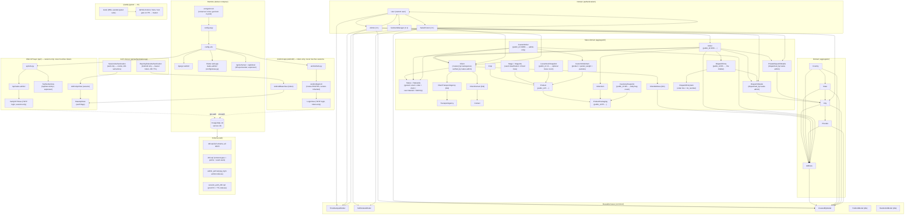

# SaiSeeds Backend ERP — Knowledge Graph

> Machine/navigation map of the codebase: every component (node), what it does,
> and how it connects to everything else. Start here before touching a system,
> then dive into [`skills/`](../skills.md) for workflow-level detail.
>
> See also: [skills.md](../skills.md) (index of domain docs), `docs/api/openapi.yml`
> (auto-generated API reference), [`docs/prd/`](prd/) (product requirements:
> what each change was for and the rules it had to satisfy, which the node
> registry below does not record).

## 1. Architecture at a glance


```mermaid
graph TD
    subgraph RUNS["Runtime (docker compose)"]
        GW["entrypoint.sh<br/>(runserver in dev, gunicorn in prod)"] --> WSGI["config.wsgi"]
        WSGI --> URLS["config.urls"]
        DB[(PostgreSQL 18<br/>service: db)]
        URLS --> ADMIN["django /admin/"]
        URLS --> FL["Flutter web app<br/>/sales-admin/ (config/views.py)"]
        URLS --> SCHEMA["/api/schema/ + /api/docs/<br/>(drf-spectacular, superuser)"]
    end

    subgraph AUTHCLASSES["Auth classes (api/authentication.py)"]
        SESSAUTH["SessionAuthentication<br/>(web only — cookie, 401 semantics)"]
        EXPTAUTH["ExpiringTokenAuthentication<br/>(Android only — bearer token, 24h TTL)"]
    end

    subgraph API["Web API layer (api/) — session-only, never touches tokens"]
        URLS --> APIROOT["api/urls.py"]
        APIROOT --> SA["/api/sales-admin/"]
        SA --> OTPVER["VerifyOTPView (TOTP login, session-only)"]
        APIROOT --> TSENTRY["TestSentryView<br/>(/api/test-sentry/, superuser)"]
        ADMINV["AdminApiView (session)"] --> BASE["BaseApiView<br/>(auth flags)"]
        SESSAUTH --> ADMINV
        OTPVER -. pre-auth .-> DB
    end

    subgraph ANDROIDAPP["Android app (android/) — token-only, never touches sessions"]
        URLS --> ANDROOT["android/urls.py"]
        ANDROOT --> AND["/android/api/v1/<br/>(routes.ROUTES, version-inherited)"]
        AND --> ANDLOGIN["LoginView (TOTP login, token-only)"]
        ANDV["AndroidBaseView (token)"] --> BASE
        EXPTAUTH --> ANDV
        ANDLOGIN -. pre-auth .-> DB
    end

    subgraph DOMAIN["Domain (authentication/)"]
        U["User (custom user)"]
        U --> ADMINP["Admin (1:1)"]
        U --> SPP["SalesPerson (1:1)"]
        U --> GMP["GodownManager (1:1)"]
    end

    subgraph AGG["Domain (aggregator/)"]
        CTRY["Country"]
        ST["State"]
        CIT["City"]
        PIN["Pincode"]
        ADDR["Address"]
        CTRY --> ST
        ST --> CIT
        CIT --> PIN
        CIT --> ADDR
        ST --> ADDR
        CTRY --> ADDR
        PIN --> ADDR
        SPP --> CIT
    end

    subgraph SALES["Sales domain (aggregator/)"]
        STATUS["Status + StatusIds<br/>(generic enum: order + client +<br/>raw material + field trip)"]
        CROP["Crop"]
        STAGE["Stage + StageIds<br/>(seed classification: 4 fixed rows)"]
        CL["Client<br/>(created_by=salesperson,<br/>verified_by=sales admin)"]
        TA["TransportAgency"]
        CON["Contact"]
        CA["ClientAddress (link)"]
        CC["ClientContact (link)"]
        CTA["ClientTransportAgency (link)"]
        PROD["Product<br/>(public_id P-…)"]
        PP["ProductPackaging<br/>(public_id PP-…)"]
        DD["DispatchDetails<br/>(dispatched_by=sales admin)"]
        PDD["PrivateDispatchDetails<br/>(dispatched_by=sales admin)"]
        ORD["Order<br/>(public_id ORD-…)"]
        OI["OrderItem"]
        DE["DispatchEntry<br/>(public_id DE-…, the challan)"]
        DEI["DispatchEntryItem<br/>(order line + lot_number)"]
        INV["InventorySnapshot<br/>(public_id INV-…, daily bag count)"]
        LS["LooseStockSnapshot<br/>(public_id LS-…, optional loose count)"]
        CORD["CustomOrder<br/>(public_id CORD-…, admin-only)"]
        COI["CustomOrderItem<br/>(product + packet_weight + packets)"]

        CL --> CA --> ADDR
        CL --> CC --> CON
        CL --> CTA --> TA
        CL --> STATUS
        CROP --> PROD --> PP
        STAGE --> PROD
        ORD --> CL
        ORD --> ADDR
        ORD --> STATUS
        ORD --> DD
        ORD --> PDD
        ORD --> DE
        DE --> DD
        DE --> DEI
        ORD --> OI --> PP
        INV --> PP
        LS --> PROD
        CORD --> CL
        CORD --> ADDR
        CORD --> STATUS
        CORD --> COI --> PROD
        DD --> CIT
        PDD --> CIT
        SPP --> CL
        SPP --> ORD
        ADMINP --> CL
        ADMINP --> DD
        ADMINP --> PDD
    end

    subgraph COMMON["Reusable bases (common/)"]
        TS["TimeStampedModel"]
        SD["SoftDeletedModel"]
        CB["CreatedByModel"]
        PID["PublicIdModel (idle)"]
        RID["RandomIdModel (idle)"]
    end

    subgraph DATA["Schema (sql/)"]
        DDL["ddl.sql (full schema, all apps)"]
        DML["dml.sql (content types + perms + seed users)"]
        APF["admin_perf.sql (pg_trgm admin indexes)"]
        S24["session_auth_24h.sql (prod FK + TTL indexes)"]
    end

    DB --> DATA
    ADMINP --> U
    SPP --> U
    ADMINP --> SD
    ADMINP --> CB
    SPP --> SD
    SPP --> CB
    ADDR --> CB
    CTRY --> CB
    ST --> CB
    CIT --> CB
    PIN --> CB
    U --> TS
    ADMINP --> TS
    SPP --> TS

    subgraph QA["Quality (pytest → CI)"]
        UNIT["tests/ (DML-seeded pytest suite)"]
        CI["GitHub Actions: Tests / test<br/>gate on PR → master"]
    end
    UNIT --> CI
```

## 2. Node registry

### Entry points & infrastructure

| Node | Path | Purpose | Edges |
|---|---|---|---|
| `web` service | `docker-compose.yml`, `Dockerfile` | Python 3.14-slim image; bind-mounts repo at `/app`; port 8000 | starts → `scripts/entrypoint.sh`; depends_on → `db` (healthy) |
| `db` service | `docker-compose.yml` | PostgreSQL 18, port 5432, named volume `postgres_data`; `pg_isready` healthcheck; `shared_buffers=128MB`; timezone UTC | provider ← web, tests, DBeaver |
| Container entrypoint | `scripts/entrypoint.sh` | Starts collectstatic → `createsuperuser_if_not_exists` → then runs **dev `runserver`** when `DEBUG=true` (live reload on bind mount) or **gunicorn** otherwise (`--workers`/`--threads` env). **`migrate` is commented out** — the whole schema is pre-applied SQL (see `sql/` below). Invoked via `bash` (Dockerfile `ENTRYPOINT ["bash", ...]`) so it needs no `+x` | runs → `config.wsgi` / `manage.py runserver` |
| WSGI / ASGI | `config/wsgi.py`, `config/asgi.py` | Gunicorn hooks in here | → `config.urls` |
| Root URLconf | `config/urls.py` | Mounts `/admin/`, `/api/` (web, session-only), `/android/` (Android app, token-only), `/api/schema|docs/` (superuser-only), `/sales-admin/...` catch-all | → `api/urls.py`, `android/urls.py`, `config.views.flutter_catch_all`, drf-spectacular views |
| Flutter catch-all | `config/views.py` | Serves `admin_saiseeds/build/web/` (committed build output) for all `/sales-admin/*` routes; SPA fallback to `index.html` | serves ← `admin_saiseeds/` |

### Configuration

| Node | Path | Purpose | Edges |
|---|---|---|---|
| `config/settings.py` | single settings module | env-driven (`SECRET_KEY`, `DEBUG`, `ALLOWED_HOSTS` have fallbacks); DRF default auth (`SessionAuthentication` + `ExpiringTokenAuthentication`) is only the fallback for views that don't pick one explicitly (e.g. the schema/docs views) — every real endpoint sets its own via `AdminApiView` (session-only) or `AndroidBaseView` (token-only); permission `IsAuthenticated`; Argon2-first password hashers; `CONN_MAX_AGE=60` + `CONN_HEALTH_CHECKS` + db `timezone=Asia/Kolkata`; WhiteNoise static with `STATIC_ROOT=staticfiles`; `SESSION_COOKIE_AGE=86400` + `TOKEN_TTL_HOURS=24`; `CORS_ALLOW_CREDENTIALS`; Sentry init when `SENTRY_DSN` set and not DEBUG | configures → all apps; reads → env vars |
| Superuser bootstrap | `config/management/commands/createsuperuser_if_not_exists.py` | Idempotent superuser create; dev fallback `9999999999/admin` when `DEBUG=True`; `DJANGO_SUPERUSER_*` env otherwise | called by → entrypoint |

### API layer

Strict client separation: the web (`api/`) app is **session-only** and never
touches `authtoken_token`; the Android app (`android/`, a separate Django app)
is **token-only** and never touches sessions. `BaseApiView` is the shared
role-flag parent both client bases build on.

| Node | Path | Purpose | Edges |
|---|---|---|---|
| `BaseApiView` | `api/views.py` | Flag-driven base (`auth_required`, `admin_required`, `superuser_required`) → DRF `get_permissions()`; does not itself pick an auth scheme | base ← `AdminApiView`, `AndroidBaseView` |
| Auth classes | `api/authentication.py` | `SessionAuthentication` (DRF session but with a real `WWW-Authenticate` challenge so anonymous = **401**, not 403; used only by the web) + `ExpiringTokenAuthentication` (24h TTL via `TOKEN_TTL_HOURS`; an expired token is deleted on first use; used only by Android) | used by → `AdminApiView`, `AndroidBaseView` |
| `AdminApiView` | `api/admin.py` | Sales-admin website base: **session cookie only** | → `BaseApiView` |
| `AdminPaginatedDateRangeListView` | `api/paginated_views.py` | Sales-admin `GET` list base (default `admin_required = True`): paginated + optional/required `start_date_time`..`end_date_time` window + a declarative filter/sort catalogue. Subclass sets `get_queryset` / `serialize_page` and optionally `date_field`, `enforce_date_range_filters`, `queryset_filters`, `sort_options`, `default_sort` | → `AdminApiView`, `common.views.paginated_date_range._PaginatedDateRangeListMixin` |
| Permissions | `api/permissions.py` | `IsRolePermission` meta-class + `IsAdminUser`, `IsSuperUser`, `IsSalesPerson`, `IsGodownManager`, `IsAndroidRole` (either Android role) | keyed off → `User.is_admin_user/is_superuser/is_salesperson` |
| Top API router | `api/urls.py` | `/api/sales-admin/`, `/api/utilities/` (web, session-only) | → namespace URLconfs |
| `VerifyOTPView` | `api/sales_admin/VerifyOTPView.py` | `POST /api/sales-admin/auth/otp/verify` — pre-auth, `AllowAny`; verifies the user's **TOTP** code, opens a session, returns the user payload + `can_create_admin`/`can_create_sales_person`/`can_create_godown_manager` flags (no token) | reads → `User`; calls → `login()` + `get_token()` (issues `sessionid` + `csrftoken` cookies) |
| `AdminDateRangeExportView` | `api/export_views.py` | Base for the date-range exports: validates `start_date`/`end_date` (inclusive IST days, ≤ 31 days), hands a `DateWindow` to `export()`, returns `{start_date, end_date, count, results}`. Business fields only — no audit columns. `admin_required` | ← the five `Export*View`s |
| `Export*View` (×5) | `api/sales_admin/Export*View.py` | `GET /api/sales-admin/export/{orders, custom-orders, dispatch-receipts, inward-entries, inventory-snapshots}`: orders / custom orders booked in the window with items and the order's city; the challans (`challan_queryset()`) of every still-dispatched order booked in the window, LR recorded or not; raw + other inward entries grouped by booking day; bag + loose counts grouped by `snapshot_date` (counted figures only) | reads → `OrderOperations`, `CustomOrderOperations`, `DispatchOperations`, `InwardOperations`, `InventoryOperations` payloads |
| `ProductStockLedgerView` | `api/sales_admin/ProductStockLedgerView.py` | `GET /api/sales-admin/product-stock-ledger/<public_id>?start_date&end_date&page&page_size` — one product's events over an inclusive IST window (max 31 days, not before the ledger's go-live), each row carrying the full running state of the bag, loose, raw and packing-material pools plus what the event `change`d; synthetic `OPENING_BALANCE` first, `CLOSING_BALANCE` last | reads → `aggregator/StockLedgerReport.py` |
| `StockLedgerOperations` | `aggregator/StockLedgerOperations.py` | `recording(...)` context manager (locks raw → bag → loose → materials, diffs live positions, writes events), count-write classification (PACKED / STOCK_ADJUSTED / STOCK_COUNTED / carried forward), `seed_ledger`, `check_ledger`. Commands: `seed_stock_ledger` (once, at go-live, before any event) and `check_stock_ledger` (non-zero exit on any mismatch). Writes that bypass the operations layer -- raw ORM, the `execute-code` page -- are not recorded and show up as a `check_stock_ledger` mismatch | calls ← `InventoryOperations`, `OrderOperations`, `CustomOrderOperations`, `InwardOperations`, the soft-delete guards, `aggregator/admin.py` |
| `ExecuteCodeView` / `execute_code_page` | `api/execute_code.py` | `POST /api/execute-code/` (outside `sales-admin/`; UI page at `GET /execute-code/`, template `api/templates/api/execute_code.html`: a vendored CodeMirror 5 editor under `api/static/api/vendor/codemirror/` with Python highlighting and autocomplete built from the execution scope -- every model, its managers and fields, and every enum defined next to a model) — runs Python with every model in scope inside one `transaction.atomic` (commit on success, rollback on error, `statement_timeout` 30s); returns `stdout`/`result`/`error`. **404 unless `ENABLE_EXECUTE_CODE=1`** (keep it off in production); when enabled, requires a superuser (`superuser_required`) **and** the `authentication.execute_python_code` permission (`required_permission` → `HasDjangoPermission`); every run is logged by user id and the code's SHA-256, never the code itself | reads/writes → any model |
| `TestSentryView` | `api/test_sentry.py` | `GET/POST /api/test-sentry/` — raises on purpose to verify error tracking (GlitchTip/Sentry); superuser-only so it can't be abused | gated by → `IsSuperUser` permission |

### Android app (separate Django app: `android/`)

Mounted at `/android/api/<version>/...` (`config/urls.py`). Version
inheritance: a view introduced at `vX` is served under every later `vY`
(`Y >= X`) unless that version overrides the same route — enforced by
`android/api/routing.py`, not left as a convention.

| Node | Path | Purpose | Edges |
|---|---|---|---|
| `AndroidTokenView` | `android/api/base.py` | Fixes the Android credential scheme (**bearer `ExpiringTokenAuthentication` only**), no role | → `BaseApiView` |
| `AndroidBaseView` / `AndroidGodownBaseView` / `AndroidSharedView` | `android/api/base.py` | The three role bases over `AndroidTokenView`: salesperson-only (`salesperson_required`), godown-manager-only (`godown_manager_required`, the `godown/…` routes) and either-role (`android_role_required`: `utilities/…`, `auth/reauthenticate`) | → `AndroidTokenView`, `api.permissions.IsSalesPerson` / `IsGodownManager` / `IsAndroidRole` |
| `api.inward_serializers` | `api/inward_serializers.py` | Inward-domain request/response serializers and filter/sort catalogues shared by the sales-admin web views and the `godown/…` Android views (the business rules stay in `aggregator.InwardOperations`, incl. `locked_raw_lot`) | used by → sales-admin inward/stock/recipe views, `Godown*View` |
| `AndroidPaginatedDateRangeListView` | `android/api/paginated_views.py` | Android `GET` list base (inherits `salesperson_required`): paginated + optional/required `start_date_time`..`end_date_time` window + a declarative filter/sort catalogue. Subclass sets `get_queryset` / `serialize_page` and optionally `date_field`, `enforce_date_range_filters`, `queryset_filters`, `sort_options`, `default_sort` | → `AndroidBaseView`, `common.views.paginated_date_range._PaginatedDateRangeListMixin` |
| Routing mechanism | `android/api/routing.py` | `merged_routes(versions)` merges each version's `routes.ROUTES` in order (later wins); `build_urlpatterns` turns the merge into urlpatterns | used by → `android/api/urls.py` |
| Version router | `android/api/urls.py` | `VERSIONS = ["v1", ...]`; mounts `<version>/` with routes inherited from every earlier version | → `routing.build_urlpatterns` |
| Android v1 | `android/api/v1/routes.py` | `ROUTES`: `auth/login` (`LoginView`), `auth/logout` (`LogoutView`), `auth/reauthenticate` (`ReauthenticateView`), `utilities/countries` (`CountriesView`), `utilities/states` (`StatesView`), `utilities/cities` (`CitiesView`), `get-clients` (`GetClientsView`), `get-orders` (`GetOrdersView`), `client/<public_id>` (`GetClientView`), `create-client` (`CreateClientView`), `update-client` (`UpdateClientView`) | → `AndroidBaseView` (except `LoginView`, pre-auth) |
| `CountriesView` / `StatesView` | `android/api/v1/CountriesView.py`, `android/api/v1/StatesView.py` | Flat address-form look-ups the client-creation form needs but nothing else exposed: `GET utilities/countries` → `[{id,name,iso_code}]`; `GET utilities/states` → `[{id,name,code,country_id}]` with optional `?country_id=`. `utilities/cities` stays the India-only state→city grouped tree | → `AndroidBaseView`; feed `country` / `state` / `city` ids to `create-client` / `update-client` |
| `GetClientView` (android + web) | `android/api/v1/GetClientView.py`, `api/sales_admin/GetClientView.py` | `GET .../client/<public_id>` — one client in full via `ClientOperations.client_payload` (core details + **every** address / contact / transport agency, each `is_primary`-flagged). Android scopes to `created_by=request.user` (a sales person only sees their own); web (`admin_required`) reads any client. Unknown / soft-deleted id → 404 | → `AndroidBaseView` / `AdminApiView`, `client_payload`, `ClientPayloadSerializer` |
| `LoginView` | `android/api/v1/LoginView.py` | `POST /android/api/v1/auth/login` — pre-auth, `AllowAny`; TOTP login for sales persons, mints/rotates a bearer `Token` (mirrors `VerifyOTPView` but token-only, no session) | reads → `User`; writes → `rest_framework.authtoken.Token` |

> Naming gotcha: `api/admin.py` defines the **`AdminApiView` base controller**, not
> the Django admin site (which lives in `authentication/admin.py`).

### Domain — authentication

| Node | Path | Purpose | Edges |
|---|---|---|---|
| `User` | `authentication/models/User.py` | Custom user (`AbstractBaseUser` + `PermissionsMixin`); `phone_number` is `USERNAME_FIELD` (10 digits, no country code); password only for staff; everyone else logs in via **TOTP authenticator app**; `created_by`/`verified_by` self-FK invariants (superusers self-reference); TOTP helpers (`generate_totp_secret`, `enable_totp`, `verify_totp`, provisioning URI); role helpers `role`, `is_salesperson`, `is_admin_user`, `is_verified_user`, `can_login_with_password` | extends → `TimeStampedModel`; related ← `Admin`, `SalesPerson` |
| `Admin` | `authentication/models/Admin.py` | Application admin profile (1:1). Only a superuser may create one; `can_update_stock_count` gates writing an `InventorySnapshot` (the day's stock count) and nothing else — it does **not** gate order verification; `share_contact` (default false) opts the admin into `utilities/sales-admins` (name + phone only) | extends → `TimeStampedModel`, `SoftDeletedModel`, `CreatedByModel`; 1:1 → `User` |
| `SalesPerson` | `authentication/models/SalesPerson.py` | Salesperson profile (1:1). Only an Admin (or superuser) may create one; `city` FK | extends → `TimeStampedModel`, `SoftDeletedModel`, `CreatedByModel`; 1:1 → `User`; FK → `aggregator.City` |
| `GodownManager` | `authentication/models/GodownManager.py` | Godown (warehouse) manager profile (1:1), no location field. Only an Admin (or superuser) may create one; losing it revokes the user's credentials | extends → `TimeStampedModel`, `SoftDeletedModel`, `CreatedByModel`; 1:1 → `User` |
| Admin site | `authentication/admin.py` | Registers `User`, `Admin`, `SalesPerson`, `GodownManager`; enforces who may grant `Admin`/`SalesPerson` roles; unregisters stock `Group` admin | configures → Django `admin` |
| Validator | `authentication/validators.py` | `^\d{10}$` 10-digit phone validator | used by → `User.phone_number` |

### Domain — aggregator (geo master data)

| Node | Path | Purpose | Edges |
|---|---|---|---|
| `Country` | `aggregator/models/Country.py` | `name` + `iso_code` (both unique, indexed); root of the geo hierarchy | extends → `TimeStampedModel`, `SoftDeletedModel`, `CreatedByModel`; 1:N → `State` |
| `State` | `aggregator/models/State.py` | `name` + optional `code`; unique `(country, name)` | 1:N → `City` |
| `City` | `aggregator/models/City.py` | `name`; unique `(state, name)`; `country` property; `ordering = name` | 1:N → `Pincode`, `Address`; ← `SalesPerson.city` |
| `Pincode` | `aggregator/models/Pincode.py` | `code`; unique `(city, code)`; `state`/`country` convenience properties | 1:N → `Address` |
| `Address` | `aggregator/models/Address.py` | Denormalised pincode/city/state/country chain so any level can be listed/filtered; `clean()` validates the chain matches. `AddressOperations.assert_geo_chain_consistent(city, state, country)` is the same city→state→country check, called up front by `create_address` **and** `sync_client_addresses` (the declarative sync matches an unchanged address by (line, pincode, city), so a bad `state`/`country` in the payload would otherwise be silently dropped instead of 400'd) | FK → all four geo nodes |
| aggregator admin | `aggregator/admin.py` | `SoftDeleteModelAdmin` + `autocomplete_fields`/`list_select_related` so related picks don't N+1 | configures → Django `admin` |

### Domain — aggregator (sales)

| Node | Path | Purpose | Edges |
|---|---|---|---|
| `Status` | `aggregator/models/Status.py` | Generic enum-like status rows (ids 1–19, seeded in `sql/dml.sql`); hosts `StatusIds` and the `Status.by_id()` resolver. **No migrations — the enum values mirror `dml.sql` rows and must be kept in sync.** | referenced by → `Order.status`, `Client.status`, `InwardRawMaterial.status`, `FieldTrip.status`, `ReturnOrder.status`, `OrderOperations`, `ClientOperations`, `InwardOperations`, `FieldTripOperations` |
| `StatusIds` | `aggregator/models/Status.py` | `enum.IntEnum` — the single source of truth for the status CODE→id mapping: member **name** == seeded `code`, member **value** == row `id` (`StatusIds.BOOKED.name == "BOOKED"`, `int(StatusIds.BOOKED) == 1`). `order_statuses()` = ids 1–7, `client_statuses()` = ids 8–9, `raw_material_statuses()` = ids 10–11, `field_trip_statuses()` = ids 12–15, `return_statuses()` = ids 17–19 (`RETURN_PENDING` / `RETURN_ACCEPTED` / `RETURN_REJECTED`). | derives → `Order.ORDER_STATUS_CODES`, `Client.CLIENT_STATUS_CODES`, `InwardRawMaterial`'s `InwardRawMaterialStatus`, `FieldTrip`'s status-code sets; used by → `OrderOperations`, `ClientOperations`, `InwardOperations`, `FieldTripOperations`, tests |
| `Stage` | `aggregator/models/Stage.py` | Seeded, enum-like seed classification of a product (ids 1–4 in `sql/dml.sql`: `BREEDER`, `FOUNDATION`, `RESEARCH`, `CERTIFIED`); hosts `StageIds` and the `Stage.by_id()` resolver. Same shape as `Status`. **No migrations — the enum values mirror `dml.sql` rows and must be kept in sync.** | referenced by → `Product.stage` |
| `StageIds` | `aggregator/models/Stage.py` | `enum.IntEnum` — the single source of truth for the stage CODE→id mapping: member **name** == seeded `code`, member **value** == row `id` (`int(StageIds.BREEDER) == 1`). | used by → `ProductsView`, `UpdateProductView`, tests |
| `Order` | `aggregator/models/Order.py` | Booked order exposed by `public_id` (`ORD-…`); `verified_by`/`verified_at` record the verifying sales admin (required once the status is `CONFIRMED`); lifecycle statuses limited to `StatusIds.order_statuses()`. No stored total — `total_amount` and `total_bags` are `@property`s summed from `items` | FK → `Client`, `Address`, `Status`; 1:N → `OrderItem` |
| `OrderItem` | `aggregator/models/OrderItem.py` | One order line: a `ProductPackaging` (a bag) at a `negotiated_selling_price` (**per-bag**) × `quantity`; `line_total = negotiated_selling_price * quantity`. Defaulted to `packaging.selling_price` when omitted at creation via `OrderOperations.add_order_item` | FK → `Order`, `ProductPackaging` |
| `ReturnOrder` | `aggregator/models/ReturnOrder.py` | Goods a client sent back against an order already shipped (`RET-…`, `docs/prd/return-orders.md`). Raised by the sales person who booked the order, then accepted / rejected by a sales admin. Lifecycle `RETURN_PENDING` → `RETURN_ACCEPTED` \| `RETURN_REJECTED`, `ACCEPTED` → `PENDING` (revert-accept), `REJECTED` → `PENDING` (unreject); only PENDING is editable. A return is **live** while PENDING or ACCEPTED and an order may have only one (partial unique index `uniq_returnorder_one_live_per_order`); a REJECTED one keeps its `order` FK but is hidden from the order's detail. `include_in_other_raw_materials` is NULL until accepted. **Accepting is inward stock**: it books `InwardRawMaterial` (In Use, dated the accept day, `lot_no` = the return's id) and optionally `InwardOtherMaterial` rows with `party` NULL and `return_order` set — so every stock screen, export and ledger figure picks them up unchanged — and the ledger records it as one `RETURN_OPERATIONS` event per product. Those lots cannot be edited or deleted through the inward or Django-admin paths; only revert-accept removes them. An order with a live return cannot have its dispatch reverted | FK → `Order`, `Status`, `User` (`created_by`, `verified_by`, `rejected_by`); 1:N → `ReturnOrderItem`, `InwardRawMaterial`, `InwardOtherMaterial`, `StockEvent` |
| `ReturnOrderItem` | `aggregator/models/ReturnOrderItem.py` | One returned line: `packets` of a `(product, packet_weight)` at a `price_per_packet`; `kg = packet_weight * packets`, `line_total = price_per_packet * packets`. Names the pair, not a `ProductPackaging`, because stock comes back as loose packets; the returnable limit per pair is the challan's `DispatchEntryItem.quantity x packaging.packets`. Unique per (`return_order`, `product`, `packet_weight`), **not** soft-delete aware, so syncing restores a removed row | FK → `ReturnOrder`, `Product` |
| `NotificationOperations` | `aggregator/NotificationOperations.py` | Push + inbox notifications for the **sales person whose work an admin acted on**. A `NotificationEvent` fixes the title, wording and app `screen` (`_SPECS`); `notify_order_event` / `notify_client_event` / `notify_return_order_event` are called at the end of the matching operation and do **everything inside `fire_and_forget`** — after the change commits, off the request thread: `deliver_event` builds the `Message` (recipient, subject, `data`), saves the `Notification` row, then `push_to_user` pushes to every `PushDevice` of the user (dead tokens are deleted). Any failure is logged and swallowed, so a broken notification never breaks the change. Events: order `CONFIRMED` / `UNDER_REVIEW` / `ON_HOLD` / `REJECTED` / `DISPATCHED` / `DISPATCH_REVERTED` / `DELIVERED` (screen `order_detail`, recipient `Order.created_by`, data `{order_public_id}`); `CLIENT_VERIFIED` (`client_detail`, `Client.created_by`, `{client_public_id}`); `RETURN_ACCEPTED` / `RETURN_REJECTED` (`return_order_detail`, `ReturnOrder.created_by`, `{return_order_public_id, order_public_id}`). Push data block: `type`, `screen`, `notification_id`, `data` (a **JSON string** — FCM values must be strings); inbox payloads carry `screen` and `data` as an object. Also `register_device`, `mark_read`, `notification_payload` | uses → `common.push.send_push`, `common.background.fire_and_forget`; called by → `OrderOperations`, `ClientOperations.verify_client`, `ReturnOrderOperations`, `RegisterDeviceView`, `GetNotificationsView`, `Mark*ReadView` |
| `PushDevice` | `aggregator/models/PushDevice.py` | One installed app, keyed by a **unique** `fcm_token` (a shared phone moves to whoever registered last); `user` FK; `updated_at` is "last seen". No soft delete: logout and dead-token cleanup hard-delete | FK → `User` |
| `Notification` | `aggregator/models/Notification.py` | In-app inbox row (`recipient`, `event_type`, `title`, `body`, `data` JSON for the target screen, optional `order`, `read_at`); written for every event whether or not the push arrives | FK → `User`, `Order` |
| `fire_and_forget` | `common/background.py` | Runs a callable in a daemon thread **after the surrounding transaction commits**; exceptions are logged, never propagated; closes the thread's DB connections | used by → `NotificationOperations` |
| `send_push` | `common/push.py` | FCM HTTP v1 sender (`requests` + `google-auth`, no `firebase-admin`): one POST per token, OAuth token minted from `FCM_SERVICE_ACCOUNT_JSON`; returns the tokens FCM says are dead (`NOT_FOUND`, or `INVALID_ARGUMENT` about the registration token). No-op with a log line when the key is unset | configured by → `FCM_PROJECT_ID`, `FCM_SERVICE_ACCOUNT_JSON`, `FCM_ANDROID_CHANNEL_ID` |
| `ReturnOrderOperations` | `aggregator/ReturnOrderOperations.py` | The whole return lifecycle: `returnable_packets`, `assert_order_returnable`, `assert_items_within_limit`, `create_return_order` / `update_return_order` (lock the order row first), `return_order_recipe_options` (live **and** deleted recipes per line), `accept_return_order` (re-checks the limit, validates the recipe choice, books the lots inside one `recording`), `revert_accept_return_order` (soft-deletes the lots by queryset update and calls `guard_stock_deletion` with no ledger of its own, so the revert is one event), `reject_return_order` / `unreject_return_order` (no stock, no ledger row) and the payload helpers. Lock order: return row, then order row, then the stock pools | used by → the return views, `OrderOperations.order_detail_payload`; reads → `InventoryOperations`, `StockLedgerOperations.recording` |
| `DispatchEntry` | `aggregator/models/DispatchEntry.py` | The **challan** for one order (`DE-…`), carrying the dated serial `challan_number` (`YYYYMMDD-XXXX`, restarting at 0001 each IST day) that a client actually quotes — derived from `dispatched_at` in `save()`, so an admin edit of that timestamp renumbers it; the day's **highest plus one**, never its count, so a number is never reused and a day may have gaps. Written by `dispatch-order` alongside the `DispatchDetails` / `PrivateDispatchDetails` row and **rewritten in place** on a re-dispatch, so one order keeps one `DE-…`. Where those tables record *the dispatch*, this records *the paperwork*: the same journey plus a **snapshot** of the receiver (`client_address`, `contact_name`, `contact_number` as they stood at dispatch) so a reprint still says what went out. Deliberately has **no `lr_number` column** — it lives on `DispatchDetails` and is read through the `lr_number` property; `dispatch_details` null means a private dispatch (`is_private`), which has no transporter and so no LR. `vehicle_number` / `driver_name` / `driver_number` are snapshotted too and may be **blank**, since an agency dispatch may leave them so. `dispatched_at` is re-stamped per consignment, unlike `created_at` | O2O → `Order`; FK → `DispatchDetails` (nullable), `Client`, `Address`, `City` x2; 1:N → `DispatchEntryItem` |
| `DispatchEntryItem` | `aggregator/models/DispatchEntryItem.py` | One challan line: an `OrderItem`'s packaging, quantity and negotiated price **copied** at dispatch time, plus the `lot_number` those bags came from — the one field that exists nowhere else. Copied rather than joined so a later edit to the order cannot rewrite a challan already in the driver's hand. Unique per (`dispatch_entry`, `product_packaging`) | FK → `DispatchEntry`, `ProductPackaging` |
| `Product` | `aggregator/models/Product.py` | Sellable product exposed by `public_id` (`P-…`); `selling_price` is a **rate per kilogram** (never used directly in order totals — see `ProductPackaging`); `price_for_weight(w)` turns it into the price of one `w`-kg packet, which is what `ProductPackaging` and `CustomOrderItem` defaults are built from. Carries a required `stage` (seed classification) and an optional `image_url` — written by `common.storage`: an absolute Supabase Storage URL when deployed, a `MEDIA_URL`-relative path on local disk in dev/tests | FK → `Crop`, `Stage`; 1:N → `ProductPackaging` |
| `ProductPackaging` | `aggregator/models/ProductPackaging.py` | A **bag**: a container of `packets` small units, each `packet_weight` kg, for a `Product` (`PP-…`). Stores a **whole-bag** `selling_price` (Decimal 12,2, NOT NULL); `ProductOperations.add_packaging(...)` defaults it to `packets * product.price_for_weight(packet_weight)` when omitted; **frozen** once stored. Downstream `OrderItem.negotiated_selling_price` defaults to this value | FK → `Product`; 1:N → `OrderItem` |
| `InventorySnapshot` | `aggregator/models/InventorySnapshot.py` | The day's **sealed-bag** count, one row per (`snapshot_date`, `product_packaging`) (`INV-…`). Bags only — the unit `OrderItem.quantity` uses, consumed by `Order`; loose stock lives in `LooseStockSnapshot`. Written only by an admin with `can_update_stock_count`. **Compulsory**: `is_stock_count_complete` gates order verification. Every day's count is kept as history; reads select one `snapshot_date` (today or the latest). Reserved/consumed are **derived** from order status, never stored, which is what makes verification and dispatch reversible | FK → `ProductPackaging`, `User` (`created_by`) |
| `LooseStockSnapshot` | `aggregator/models/LooseStockSnapshot.py` | Loose stock — stock **in a packet but not in a bag** — one row per (`snapshot_date`, `product`, `packet_weight`) (`LS-…`). Deliberately **no packaging FK**: that pair is all the identity a loose packet has, so a product packed as both 1kg × 20 and 1kg × 30 has **one** pool of loose 1kg packets. Consumed only by `CustomOrder`. **Optional** — excluded from `is_stock_count_complete`, kept as history on its **own** date lifecycle independently of `InventorySnapshot`, and read at `InventoryOperations.loose_date()` (the latest loose date) rather than today | FK → `Product`, `User` (`created_by`) |
| `StockEvent` | `aggregator/models/StockEvent.py` | The header of the **product stock ledger** (`docs/prd/product-stock-ledger.md`): one row per write per product, with a smallint `event_type` / `detail` enum (`StockEventType`, `StockEventDetail`; `VALID_DETAILS` lists which details each type may carry), `occurred_at`, the `actor` and the one source row behind it (order, custom order, return order, inward lot, waste, count). Append-only. Written only by `StockLedgerOperations.recording`, which reads the live figures with the same functions the stock screens use, lets the write run, reads again and stores the **difference** -- so the ledger equals the screens by construction. No change, no row | FK → `Product`, `User`, `Order`, `CustomOrder`, `ReturnOrder`, `InwardRawMaterial`, `InwardOtherMaterial`, `RawMaterialWaste`, `InventorySnapshot`, `LooseStockSnapshot` |
| `StockEventLine` | `aggregator/models/StockEventLine.py` | What one `StockEvent` moved in one pool, as **signed deltas only** (unused columns NULL): `pool_kind` BAG (per packaging) / LOOSE (per packet weight) / RAW / OTHER (per packing-material type), with `d_on_hand`, `d_reserved`, `d_consumed`, `d_incoming`, `d_packed`, `d_rejected`, `d_wasted`. A material type's pool-wide `incoming` is written once per write, so summing a type's lines across products never double counts it. `available` is never stored | FK → `StockEvent`, `ProductPackaging`, `OtherMaterialType` |
| `PackedRecipeLayer` | `aggregator/models/PackedRecipeLayer.py` | How many of a count row's packed packets were packed under which `OtherMaterialRecipe` (NULL recipe = packed while none existed). Freezes packing-material usage at packing time, so a recipe change (delete + create; uniqueness covers **live** recipes only) never re-values packed packets. Kept in step with each pool's packed packets by `StockLedgerOperations.recording` (packing layers at the live recipes, unpacking removes newest first), copied onto a new count row, and read by `InventoryOperations.other_material_used` | FK → `InventorySnapshot` or `LooseStockSnapshot`, `OtherMaterialType`, `OtherMaterialRecipe` |
| `CustomOrder` | `aggregator/models/CustomOrder.py` | Loose-packet order (`CORD-…`), the **admin-only** counterpart of `Order`. Mirrors `Order`'s fields but is **standalone — no FK to `Order`**. **No verification step**: `create_custom_order` auto-confirms it (born `CONFIRMED`, `verified_by`/`verified_at` set), and creation is **blocked unless enough loose packets are in stock**. `created_by` must be an admin. `total_packets` sums line packets directly | FK → `Client`, `Address`, `Status`, `DispatchDetails`; 1:N → `CustomOrderItem` |
| `CustomOrderItem` | `aggregator/models/CustomOrderItem.py` | One custom-order line: a `Product` at a `packet_weight`, a `packets` count and a **per-packet** `negotiated_selling_price` (defaults to `product.price_for_weight(packet_weight)`, so a 500g line prefills at half a 1kg line). Deliberately has **no `ProductPackaging`** — it names the same (`product`, `packet_weight`) pair `LooseStockSnapshot` is keyed by. Unique per (`custom_order`, `product`, `packet_weight`), so one order may carry a 1kg line and a 500g line of the same product; `line_total = negotiated_selling_price * packets` | FK → `CustomOrder`, `Product` |
| `FieldTrip` | `aggregator/models/FieldTrip.py` | A sales person's trip to one village (`FT-…`): `city` + free-text `village`, a planned `expected_start_at`/`expected_end_at` window and the server-stamped `started_at`/`ended_at`. Lifecycle PLANNED → APPROVED → IN_PROGRESS → COMPLETED (`StatusIds.field_trip_statuses()`); `approved_by`/`approved_at` record the sales admin (required from APPROVED on). `created_by` is the sales person. Only PLANNED/APPROVED trips can be deleted — `delete()` and `mark_deleted()` both refuse otherwise. A partial unique index keeps one IN_PROGRESS trip per sales person. Transitions live in `aggregator/FieldTripOperations.py` | FK → `City`, `Status`, `User` (`created_by`, `approved_by`); 1:N → `FarmerVisit` |
| `FarmerVisit` | `aggregator/models/FarmerVisit.py` | One farmer met on a `FieldTrip` (`FV-…`): name, 10-digit `contact_number` (unique per trip), `village` (defaults to the trip's), `land_area_bigha`. A visit, not a farmer master record. Recorded only while the trip is IN_PROGRESS. `uses_our_products` is derived from its `FarmerVisitProduct` rows, never stored | FK → `FieldTrip`; 1:N → `FarmerVisitCrop`, `FarmerVisitProduct` |
| `FarmerVisitCrop` / `FarmerVisitProduct` | `aggregator/models/FarmerVisitCrop.py`, `FarmerVisitProduct.py` | Link rows: the crops a visited farmer grows (at least one) and our products they use (none = does not use ours) | FK → `FarmerVisit`, `Crop` / `Product` |
| `Client` | `aggregator/models/Client.py` | Customer company (`C-…`); verification statuses limited to `StatusIds.client_statuses()`. Created by a sales person as `VERIFICATION_PENDING`, approved by an admin through `/api/sales-admin/verify-client/`. Always carries at least one address, contact and transport agency, each list with exactly one primary | FK → `Status`, `User` (`verified_by`); 1:N → `ClientAddress`, `ClientContact`, `ClientTransportAgency` |

### Reusable bases — common

| Node | Path | Purpose | Used by |
|---|---|---|---|
| `TimeStampedModel` | `common/models/timestamped.py` | `created_at` (`indian_now`) / `updated_at`; `indian_now()` = Asia/Kolkata localtime | `User`, `Admin`, `SalesPerson`, aggregator models |
| `CreatedByModel` | `common/models/created_by.py` | `created_by` user audit FK (`PROTECT`, auto-filled with `request.user` by `AuditFieldsAdminMixin` if you use ModelAdmin) | `Admin`, `SalesPerson`, all aggregator models |
| `SoftDeletedModel` | `common/models/soft_deleted.py` | Soft delete: `is_deleted`/`deleted_at`/`deleted_by`; managers `objects` (hide deleted) + `all_objects`; `delete()` requires `deleted_by` with the `delete_<model>` permission; `hard_delete()`, `restore()` | `Admin`, `SalesPerson`, aggregator models |
| Admin helpers | `common/admin.py`, `common/models/` | `AuditFieldsAdminMixin` (read-only audit fieldsets, auto `created_by`) + `SoftDeleteModelAdmin` (soft delete through the admin) | aggregator + auth admins |
| `PublicIdModel` | `common/models/public_id.py` | 12-char `public_id` for user-facing refs (intended for orders/invoices) | (no concrete use yet) |
| `RandomIdModel` | `common/models/random_id.py` | random `UUIDField` column | (no concrete use yet) |
| `_PaginatedDateRangeListMixin` | `common/views/paginated_date_range.py` | Provides `GET` for a paginated list view: `start_date_time`..`end_date_time` window on `date_field` (default `"created_at"`, `__` lookups ok; `enforce_date_range_filters=False` makes it optional) → declared `queryset_filters` (any `ListFilter`; those whose param(s) are present are AND-ed) → declared `sort_options` (`?sort=<-?name,...>`, `pk` tie-breaker always appended, else `default_sort`) → paginate. Reserved param names: `page`, `page_size`, `sort`, `start_date_time`, `end_date_time`. Every response echoes `available_filters` / `available_sorts` (each entry carrying a human-readable `label` alongside the param/token name); a bare request returns page 1. Subclass implements `get_queryset` + `serialize_page` | used by → `AdminPaginatedDateRangeListView`, `AndroidPaginatedDateRangeListView` |
| `StandardPageNumberPagination` | `common/views/paginated_date_range.py` | Project default `PageNumberPagination` (`?page=`, `?page_size=`, default 10, max 30). Page-number envelope: `{total_count, total_pages, next_page_number, previous_page_number, results}` (page numbers, not URLs; `next`/`previous` are `null` at the ends; `total_pages >= 1`) | used by → `_PaginatedDateRangeListMixin` |
| `DateRangeQuerySerializer` | `common/views/paginated_date_range.py` | Validates `start_date_time` / `end_date_time` query params (ISO datetimes, `start <= end`) | used by → `_PaginatedDateRangeListMixin` |
| `ListFilter` (ABC) + `QuerysetFilter` / `RangeFilter` | `common/views/paginated_date_range.py` | Declarative list filters, each owning its param(s), self-applying from the request and self-describing for `available_filters` with a `kind` (widget hint). **`QuerysetFilter`**: one param `?<name>=<csv>` (OR within, AND across); `name` is the ORM lookup unless `lookup=` overrides it; `parse` (default `parse_int`, cap 100); `multi=False` → single free-text term, no comma split (substring search); `apply` for relation spans / `.distinct()` / `Q`; `options` (static list or `(request)->list` of `{value,label}`, flips `kind` to `select`; build it so an all-null column yields no choices at all, as `GetClientsView.verified_by` does). Both filter types take `label=` (human-readable field name, defaulted by `humanize()`). **`RangeFilter`**: a `?<name>_after=` / `?<name>_before=` pair (suffixes configurable, e.g. `gte`/`lte`) → `field__gte`/`__lte`; `parse` default `parse_datetime` (also `parse_date`, `parse_int`); `kind` = `<type>_range`. Parsers: `parse_int`, `parse_str`, `parse_date`, `parse_datetime` | used by → `_PaginatedDateRangeListMixin`, `GetClientsView` (`city_id`, `status`, `company_name`, `address`, `created`) |
| `SortOption` | `common/views/paginated_date_range.py` | One declarative sort key: `name` (the `?sort=` token, `-` prefix = desc), `fields` (ORM `order_by` fragments, default `(name,)`, flipped for desc) | used by → `_PaginatedDateRangeListMixin`, `GetClientsView` (`created_at`, `company_name`) |
| `list_query_parameters()` + catalogue serializers | `common/views/paginated_date_range.py` | Builds the drf-spectacular `parameters` list from a view's filters (each `ListFilter` emits its own `openapi_parameters()`) / `sort_options` (+ `page`/`page_size`/`date_window`) so the OpenAPI query string stays in lockstep; `FilterCatalogueEntrySerializer` (`filter`/`kind`/`description`/`params?`/`options?`) / `SortCatalogueEntrySerializer` type the response catalogue keys | used by → `GetClientsView.@extend_schema` |

### Schema & data

| Node | Path | Purpose | Edges |
|---|---|---|---|
| `sql/ddl.sql` | full schema | **Every** table — Django built-ins (`django_migrations`, `django_content_type`, `auth_*`, `django_session`, `django_admin_log`), custom apps (`authentication_*`, `aggregator_*`), and `authtoken_token`. Dev/test reference; prod schema applied manually on Neon | consumed by → `reload_db.sh` |
| `sql/dml.sql` | seed data | Content types (14) + permissions (56, 4 per model) + **reconciliation superuser** `9999999999` (with TOTP secret `JBSWY3DPEHPK3PXP`) + a no-TOTP user `8888888888` for the negative-path test. Idempotent `ON CONFLICT DO NOTHING`, `setval()` sequence resets, wrapped in txn | consumed by → same as above |
| `sql/admin_perf.sql` | prod DDL | `pg_trgm` extension + GIN trigram indexes on `authentication_user(name, email)` for Django admin `ILIKE` search | applied to → local/test DBs, Neon (manual) |
| `sql/session_auth_24h.sql` | prod DDL | `authtoken_token.user_id` FK (DRF only adds it via migrate) + `created` index for the TTL expiry sweep | applied to → Neon (manual) |
| `MIGRATION_MODULES` | `config/settings.py` | Disables migrations for built-in `django.*` apps via a dict comprehension (settings comment additionally states the project apps are schema-managed). **No migration files exist** — the repo has one empty `authentication/migrations/` dir. The *entire* schema is SQL-managed; with no migrations, Django's test runner syncs test tables straight from the models and `tests/common.py` seeds the `dml.sql` data | drives → `migrate` behaviour |

### Tooling & quality

| Node | Path | Purpose | Edges |
|---|---|---|---|
| `scripts/run.sh` | single entry point | `build/up/down/restart/reload-db/logs/status/shell/psql/flutter/schema/test/test-unit/test-dml/lint/typecheck`. Tests/lint/typecheck run in **short-lived one-off `web` containers** (`compose run --rm --no-deps --entrypoint ""`) to avoid booting gunicorn | calls → `reload_db.sh`, compose |
| `scripts/reload_db.sh` | local DB reload | `--step all/ddl/dml`; **local Docker Postgres only, never prod** | reads → `sql/ddl.sql`, `sql/dml.sql`, `.env.dev` |
| Test suite | `tests/` | DML-seeded pytest suite (models, order/client operations, TOTP/auth flow, token TTL); every class/method carries its pytest node-id docstring | uses → `tests/common.py` (`DMLTestCase` re-seeds `sql/dml.sql`); run via → `test-unit` / `test-dml` |
| CI | `.github/workflows/tests.yml` | Builds images, starts `db`, runs `test-unit` + `test-dml` + `lint` in one-off containers | gate on → PRs to `master`; renders check `Tests / test` |
| Branch protection | GitHub settings | `master` requires `Tests / test` to pass + PR review | enforced by → GitHub |
| Skills | `skills/*.md`, `.agents/skills/run-tests/SKILL.md` | Domain knowledge + test-run instructions (node-id docstring convention) | read before editing |

## 3. Data model

```mermaid
erDiagram
    USER ||--o| ADMIN : "admin_profile (1:1)"
    USER ||--o| SALESPERSON : "salesperson_profile (1:1)"
    USER ||--o| GODOWNMANAGER : "godown_manager_profile (1:1)"
    USER o|--o| USER : "created_by / verified_by (self-FK)"
    SALESPERSON o|--o| CITY : "city FK"
    COUNTRY ||--o{ STATE : "states"
    STATE ||--o{ CITY : "cities"
    CITY ||--o{ PINCODE : "pincodes"
    CITY ||--o{ ADDRESS : "city"
    STATE ||--o{ ADDRESS : "state"
    COUNTRY ||--o{ ADDRESS : "country"
    PINCODE ||--o{ ADDRESS : "pincode"

    USER {
        char phone_number "10 digits, unique, USERNAME_FIELD"
        char name
        email email
        bool is_verified is_staff is_superuser is_active
        bool totp_enabled
        char totp_secret "base32, nullable"
        fk created_by "self; superusers self-reference"
        fk verified_by "required when is_verified"
        dt date_joined
    }
    ADMIN {
        fk user "1:1, CASCADE"
        bool can_update_stock_count "gates writing an InventorySnapshot"
        bool share_contact "listed on utilities/sales-admins"
        fk created_by "PROTECT; acting request.user"
        bool is_deleted "soft delete"
    }
    GODOWNMANAGER {
        fk user "1:1, CASCADE"
        fk created_by "PROTECT; acting request.user"
        bool is_deleted "soft delete"
    }
    SALESPERSON {
        fk user "1:1, CASCADE"
        fk city "→ aggregator_city"
        fk created_by "PROTECT; acting request.user"
        bool is_deleted "soft delete"
    }
    COUNTRY {
        char name "unique"
        char iso_code "unique, ISO 3166"
    }
    STATE {
        char name "(country, name) unique"
        char code "nullable, e.g. MH"
        fk country "PROTECT"
    }
    CITY {
        char name "(state, name) unique"
        fk state "PROTECT"
    }
    PINCODE {
        char code "(city, code) unique"
        fk city "PROTECT"
    }
    ADDRESS {
        char address_line_1
        char address_line_2 "optional"
        fk pincode "PROTECT"
        fk city "PROTECT"
        fk state "PROTECT"
        fk country "PROTECT"
    }
```

> Statuses are not drawn above: `aggregator_status` is a generic seed table
> referenced via `Order.status` / `Client.status` / `InwardRawMaterial.status` /
> `FieldTrip.status`. The seeded CODE→id mapping lives in Python in
> `StatusIds` (`aggregator/models/Status.py`) and must be kept in sync with
> the `sql/dml.sql` rows.

## 4. URL / routing map

```
/                    -> 404
/admin/              -> Django admin (authentication/admin.py + aggregator/admin.py)
/api/                                          (web, SESSION-ONLY, never touches tokens)
├── sales-admin/
│   ├── auth/otp/verify      POST  VerifyOTPView          (AllowAny → TOTP login, opens a session)
│   ├── auth/logout          POST  LogoutView             (IsAuthenticated → flushes session)
│   ├── admins               GET/POST  AdminsView         (IsSuperUser)
│   ├── admins/<int:id>      PATCH/DELETE  UpdateAdminView (IsSuperUser)
│   ├── sales-people         GET/POST  SalesPeopleView    (IsAdminUser)
│   ├── sales-people/<int:id> PATCH/DELETE  UpdateSalesPersonView (IsAdminUser)
│   ├── godown-managers      GET/POST  GodownManagersView (IsAdminUser)
│   ├── godown-managers/<int:id> PATCH/DELETE  UpdateGodownManagerView (IsAdminUser)
│   ├── verify-client/       POST  VerifyClientView       (IsAdminUser → marks VERIFIED + verified_by/at)
│   ├── update-client/       POST  UpdateClientView       (IsAdminUser → core fields + any list)
│   ├── get-clients/         GET   GetClientsView         (IsAdminUser → every client; paginated; ?created_by / ?verified_by / ?city_id / ?status / ?company_name / ?address / ?created_gte / ?created_lte filters + ?sort; catalogues in available_filters/available_sorts)
│   ├── client/<public_id>   GET   GetClientView          (IsAdminUser → any client, full detail)
│   ├── orders/              GET   GetOrdersView          (IsAdminUser → every order; paginated; ?created_by / ?client / ?product / ?city_id / ?status filters + ?sort=created_at|price; catalogues in available_filters/available_sorts)
│   ├── order/<public_id>    GET   GetOrderView           (IsAdminUser → any order, full detail + the client in full)
│   ├── edit-order/<public_id>      PATCH UpdateOrderView (IsAdminUser → core fields + declarative item list; BOOKED/CONFIRMED only; CONFIRMED re-checks stock)
│   ├── verify-order/<public_id>    POST  VerifyOrderView      (IsAdminUser → BOOKED/UNDER_REVIEW/ON_HOLD → CONFIRMED, gated on today's stock count)
│   ├── unverify-order/<public_id>  POST  UnverifyOrderView    (IsAdminUser → CONFIRMED → UNDER_REVIEW, clears verified_by/at)
│   ├── dispatch-order/<public_id>  POST  DispatchOrderView    (IsAdminUser → CONFIRMED → DISPATCHED; kind follows the order's transport agency; LR always optional, driver/vehicle optional on an agency dispatch only — `assert_driver_details`)
│   ├── revert-dispatch/<public_id> POST  RevertDispatchView   (IsAdminUser → DISPATCHED → CONFIRMED; **only a dispatch recorded today** — so re-dispatch is same-day only too)
│   ├── hold-order/<public_id>      POST  HoldOrderView        (IsAdminUser → ON_HOLD; releases reserved bags)
│   ├── reject-order/<public_id>    POST  RejectOrderView      (IsAdminUser → REJECTED; terminal)
│   ├── return-orders/              GET   GetReturnOrdersView  (IsAdminUser → every return; paginated; ?status / ?created_by / ?client / ?product / ?order / ?public_id filters + ?sort=created_at|value)
│   ├── edit-return-order/<public_id>       PATCH UpdateReturnOrderView        (IsAdminUser → declarative item list + return_date; PENDING only)
│   ├── return-order-recipes/<public_id>    GET   ReturnOrderRecipesView       (IsAdminUser → per line, every recipe of (product, packet_weight) incl. deleted; the accept picker)
│   ├── accept-return-order/<public_id>     POST  AcceptReturnOrderView        (IsAdminUser → PENDING → ACCEPTED; books inward stock; `include_in_other_raw_materials` + `recipe_public_ids`)
│   ├── reject-return-order/<public_id>     POST  RejectReturnOrderView        (IsAdminUser → PENDING → REJECTED; no stock moves)
│   ├── unreject-return-order/<public_id>   POST  UnrejectReturnOrderView      (IsAdminUser → REJECTED → PENDING; re-checks the limit and the one-live rule)
│   ├── revert-accept-return-order/<public_id> POST RevertAcceptReturnOrderView (IsAdminUser → ACCEPTED → PENDING; removes the inward lots, 400 if they were packed)
│   ├── field-trips/                GET   GetFieldTripsView    (IsAdminUser → every trip; paginated; ?created_by / ?status / ?city_id / ?village / ?expected_start_gte|lte + ?sort=expected_start_at|created_at)
│   ├── field-trip/<public_id>      GET/DELETE FieldTripView  (IsAdminUser → full trip; DELETE only PLANNED/APPROVED)
│   ├── field-trip-farmer-visits/<public_id> GET GetFieldTripFarmerVisitsView (IsAdminUser → farmers on the trip; ?crop / ?product / ?uses_our_products)
│   ├── edit-field-trip/<public_id> PATCH UpdateFieldTripView  (IsAdminUser → city/village/expected window; PLANNED only)
│   ├── approve-field-trip/<public_id>   POST ApproveFieldTripView   (IsAdminUser → PLANNED → APPROVED, sets approved_by/at)
│   └── unapprove-field-trip/<public_id> POST UnapproveFieldTripView (IsAdminUser → APPROVED → PLANNED, clears approved_by/at)
├── utilities/
│   ├── reauthenticate       GET   ReauthenticateView      (IsAuthenticated)
│   ├── cities               GET   CitiesView              (IsAdminUser)
│   ├── states               GET   StatesView              (IsAdminUser → ?country=<id>)
│   └── countries            GET   CountriesView           (IsAdminUser)
└── test-sentry/          GET/POST  TestSentryView (superuser → forced 500)
/api/schema/         -> OpenAPI JSON   (drf-spectacular, superuser only)
/api/docs/           -> Swagger UI
/android/                                      (Android app, TOKEN-ONLY, never touches sessions)
└── api/
    └── v1/                    (routes.ROUTES; inherited by every later version)
        ├── auth/login         POST  LoginView            (AllowAny → TOTP login, mints a token)
        ├── auth/logout        POST  LogoutView           (any valid token → deletes the token and the user's push devices)
        ├── devices/register   POST  RegisterDeviceView   (IsSalesPerson → {fcm_token, app_version?}; upserts the FCM token for the caller, moving it off any previous owner)
        ├── notifications      GET   GetNotificationsView (IsSalesPerson → own inbox, newest first; paginated; ?is_read=true|false)
        ├── notifications/read-all POST MarkAllNotificationsReadView (IsSalesPerson → marks the caller's inbox read)
        ├── notification/<id>/read POST MarkNotificationReadView (IsSalesPerson → marks one of the caller's own; another user's id is 404)
        ├── auth/reauthenticate GET  ReauthenticateView    (IsAndroidRole → user incl. is_sales_person / is_godown_manager)
        ├── utilities/countries GET  CountriesView         (IsSalesPerson → [{id,name,iso_code}])
        ├── utilities/states   GET   StatesView            (IsSalesPerson → [{id,name,code,country_id}], ?country_id=)
        ├── utilities/cities   GET   CitiesView            (IsSalesPerson → India state→city tree)
        ├── analytics          GET   AnalyticsView         (IsSalesPerson → own order/client counts by status in ?start_date_time..?end_date_time; kg booked grouped by product, split by order status)
        ├── get-clients        GET   GetClientsView        (IsSalesPerson → own clients; paginated; ?city_id / ?status / ?company_name / ?address / ?created_gte / ?created_lte filters + ?sort; catalogues in available_filters/available_sorts)
        ├── get-orders         GET   GetOrdersView         (IsSalesPerson -> own orders; paginated; ?client / ?product / ?city_id / ?status filters + ?sort=created_at|price; catalogues in available_filters/available_sorts)
        ├── return-order/<order_public_id> GET/POST ReturnOrderView (IsSalesPerson → own dispatched/delivered order only: GET prefill of challan lines + returnable packets + suggested price; POST raises a PENDING return)
        ├── get-return-orders  GET   GetReturnOrdersView   (IsSalesPerson -> own returns; paginated; ?status / ?order filters + ?sort=created_at)
        ├── get-challans       GET   GetChallansView       (IsSalesPerson -> challans of OWN orders still DISPATCHED/DELIVERED; paginated; date window REQUIRED; ?client / ?city_id / ?status / ?challan_number; reuses the website's challan queryset + payload)
        ├── get-challan/<order_public_id> GET GetChallanView (IsSalesPerson -> one own order's challan; 404 for anyone else's, undispatched, reverted or custom orders)
        ├── client/<public_id> GET   GetClientView         (IsSalesPerson → own client, full detail: core + all addresses/contacts/agencies)
        ├── create-client      POST  CreateClientView      (IsSalesPerson → born VERIFICATION_PENDING)
        ├── update-client      POST  UpdateClientView      (IsSalesPerson → own client's three lists only)
        ├── utilities/crops    GET   CropsView             (IsSalesPerson → every crop, unpaginated)
        ├── utilities/products GET   ProductsView          (IsSalesPerson → every product with crop_id, unpaginated)
        ├── create-field-trip  POST  CreateFieldTripView   (IsSalesPerson → born PLANNED)
        ├── get-field-trips    GET   GetFieldTripsView     (IsSalesPerson → own trips; paginated; ?status / ?city_id / ?village / ?expected_start_gte|lte)
        ├── edit-field-trip/<public_id>   PATCH UpdateFieldTripView (IsSalesPerson → own PLANNED/APPROVED trip; APPROVED → PLANNED)
        ├── start-field-trip/<public_id>  POST  StartFieldTripView  (IsSalesPerson → APPROVED → IN_PROGRESS; one at a time)
        ├── end-field-trip/<public_id>    POST  EndFieldTripView    (IsSalesPerson → IN_PROGRESS → COMPLETED)
        ├── delete-field-trip/<public_id> DELETE DeleteFieldTripView (IsSalesPerson → own PLANNED/APPROVED trip)
        ├── field-trip-farmer-visits/<public_id> GET GetFieldTripFarmerVisitsView (IsSalesPerson → farmers on own trip)
        ├── create-farmer-visit POST CreateFarmerVisitView (IsSalesPerson → own IN_PROGRESS trip only)
        ├── utilities/parties  GET   PartiesView           (IsAndroidRole → flat party list)
        ├── utilities/other-material-types GET OtherMaterialTypesView (IsAndroidRole → flat list)
        ├── utilities/sales-admins GET SalesAdminsView     (IsAndroidRole → [{name, phone_number}], share_contact admins only)
        ├── godown/raw-material-stock   GET  GodownRawMaterialStockView   (IsGodownManager)
        ├── godown/other-material-stock GET  GodownOtherMaterialStockView (IsGodownManager)
        ├── godown/inward-raw-materials GET/POST GodownInwardRawMaterialsView (IsGodownManager → paginated lots / book a lot)
        ├── godown/inward-raw-material/<public_id> PATCH/DELETE UpdateGodownInwardRawMaterialView (IsGodownManager → InwardOperations lifecycle + removability)
        ├── godown/inward-other-materials GET/POST GodownInwardOtherMaterialsView (IsGodownManager)
        ├── godown/inward-other-material/<public_id> PATCH/DELETE UpdateGodownInwardOtherMaterialView (IsGodownManager)
        └── godown/other-material-recipes GET GodownOtherMaterialRecipesView (IsGodownManager, view-only)
/sales-admin[/...]   -> Flutter build  (config/views.py catch-all)
```

> Route convention: single-object URLs use `<int:id>` (never `<int:pk>`); the
> view receives it as the `id` kwarg and looks the row up with `id=…`.

> Auth model: **strict client separation**. `api/` (web) uses
> `AdminApiView` → `SessionAuthentication` only; `android/` uses
> `AndroidBaseView` → `ExpiringTokenAuthentication` only (24h TTL). The DRF
> global default (`SessionAuthentication` + `ExpiringTokenAuthentication`,
> `IsAuthenticated`) is only a fallback for views that pick neither base
> explicitly (schema/docs). Pre-auth endpoints (`VerifyOTPView`,
> `android.api.v1.LoginView`) opt out with `authentication_classes = []` and
> `permission_classes = [AllowAny]`.
>
> **CSRF on API routes:** DRF `APIView` handlers are wrapped in `csrf_exempt`,
> so the global `CsrfViewMiddleware` never gates DRF endpoints. CSRF is
> enforced only by DRF `SessionAuthentication` on session-authenticated
> state-changing requests — i.e. only on the web side. `VerifyOTPView` calls
> `get_token(request)` so the login response ships a `csrftoken` cookie; the
> Flutter SPA must read that cookie and echo it via the `X-CSRFToken` header
> on later POSTs (see `skills/api.md` for the exact flow). The Android side
> has no session and therefore no CSRF concern.

## 5. Data & schema flow

```
models/*.py ----(DBeaver: copy table DDL)---->  Neon SQL Editor (prod, manual)
                    |
                    v
            sql/ddl.sql (full schema reference)

sql/ddl.sql + sql/dml.sql + sql/admin_perf.sql
    ----reload_db.sh---->
            local Docker "django" DB

No migration files exist in the repo. `migrate` is commented out of the
entrypoint; with no migrations, Django's test runner syncs the test tables
straight from the models, and `tests/common.py` (`DMLTestCase`) re-seeds the
`sql/dml.sql` rows so tests share the canonical seeded ids.
```

## 6. Test & release flow

```
feature branch → PR to master
  → GitHub Actions "Tests / test" (test-unit + test-dml + lint)
      ↑ branch protection blocks merge until it passes
master merged → Render auto-deploy (Docker build)
  → entrypoint: collectstatic → createsuperuser_if_not_exists → runserver (dev) / gunicorn (prod)
  → keep-alive cron pings every 10 min (prevents cold starts)
```

## 7. Gotchas / invariants

- **No migrations anywhere.** The whole schema is SQL-managed: `sql/ddl.sql`
  covers every table and `migrate` is commented out of the entrypoint; the
  pytest test DB is synced from the models and `DMLTestCase` seeds `dml.sql`.
- Prod (Neon) schema is applied **manually** — never rely on `migrate` in prod; never run `reload_db.sh` against prod.
- `admin_saiseeds/build/web/` (Flutter) is **committed**; rebuild with `bash scripts/run.sh flutter` before pushing Flutter changes.
- Tests never boot gunicorn: they run in short-lived one-off `web` containers against the `db` service.
- **Auth/TOTP:** non-staff users log in with an **authenticator app (TOTP)**, not SMS/OTP. Web login is `POST /api/sales-admin/auth/otp/verify` (admins/superusers, opens a session); Android login is `POST /android/api/v1/auth/login` (sales persons, mints a token). Neither has an `otp/request` step.
- **Role creation:** only superusers can create Admins; superusers *and* Admins can create SalesPeople. Admins (and superusers) also create `GodownManager`s. `VerifyOTPView` exposes this to the SPA via `can_create_admin` / `can_create_sales_person` / `can_create_godown_manager`.
- **Strict client separation:** the web (`api/`) is session-only and never touches `authtoken_token`; the Android app (`android/`) is token-only and never touches sessions/`django_session`. `AdminApiView` and `AndroidBaseView` are the two client base views that enforce this — no view should extend `BaseApiView` directly.
- **Token TTL:** bearer tokens die `TOKEN_TTL_HOURS` (24) after their last "login"; `ExpiringTokenAuthentication` deletes an expired token on first use so the next request forces a fresh login. Session cookies share the same 24h through `SESSION_COOKIE_AGE`.
- **401 vs 403:** the custom `SessionAuthentication`/`ExpiringTokenAuthentication` return a `WWW-Authenticate` challenge header, which is what keeps anonymous calls a **401** instead of DRF's default 403.
- **CSRF is *not* enforced by the global middleware on DRF routes** (view handlers are `csrf_exempt`); only DRF `SessionAuthentication` enforces it, so the sales-admin SPA must send the `csrftoken` cookie value as `X-CSRFToken` on every session-authenticated POST/PUT/PATCH/DELETE. Android's bearer-token requests carry no cookie and are unaffected.
- **Android API versioning:** `android/api/routing.py` merges each version's `routes.py::ROUTES` in order, so a view introduced at `vX` is automatically served by every later `vY` (`Y >= X`) unless that version overrides the same route key.
- **Sentry/GlitchTip** only initialises when `SENTRY_DSN` is set and `DEBUG` is false; `/api/test-sentry/` is the wired-up probe.
- `api/admin.py` = `AdminApiView` base, not Django admin.
- **`Product.is_usable` (frozen product).** `false` freezes a product without deleting it: no inward lot, waste, packaging, recipe, count or booking can be created or changed for it, and its existing rows are read-only (including flipping a raw lot's status or deleting a lot/waste/packaging/recipe). One rule enforces it -- `ProductOperations.assert_products_usable`, called first by every writer inside its transaction, after the stock-ledger `recording` has taken the locks (so the switch in `UpdateProductView`, which locks the same product row, serialises with in-flight writes). Releases stay open: hold / reject / unverify / revert-dispatch, withdrawing a custom order, and order edits that only lower or remove a frozen line. A frozen product's packagings drop out of the "count complete" gate and out of a full count upload; the system **carries their last count forward** onto each new date (`carry_frozen`) so stock, raw and packing material never move. History, exports, ledger and stock reports keep showing it (with `is_usable`); only the pickers hide it: the sales-person catalogue, the `?all=true` recipe picker, Android `utilities/products`, and the web `products` and `product-packagings` lists, which return **usable products only by default** -- the product management page asks for the frozen ones with `?is_usable=all` (or `false`) so a product can be switched back on. History-list filter dropdowns (orders, returns, lots, waste) are unchanged: they describe existing records. Return orders follow it: a frozen product's return line cannot be raised or added, accepting a return (which books inward lots) is refused, and so is reverting an accept; rejecting a return stays open. Prod (Neon): `ALTER TABLE public.aggregator_product ADD COLUMN is_usable bool NOT NULL DEFAULT true;`.
- **Pricing units** — `Product.selling_price` is **per-packet**; `ProductPackaging.selling_price` and `OrderItem.negotiated_selling_price` are **per-bag**. `OrderItem.line_total = negotiated_selling_price * quantity`. `ProductPackaging.selling_price` defaults to `packets * product.selling_price` at creation and is frozen thereafter; `OrderItem.negotiated_selling_price` defaults to `packaging.selling_price`. See `skills/conventions.md` § "Pricing units".

_Keep this graph in sync when adding apps, endpoints, models, or schema flows._
